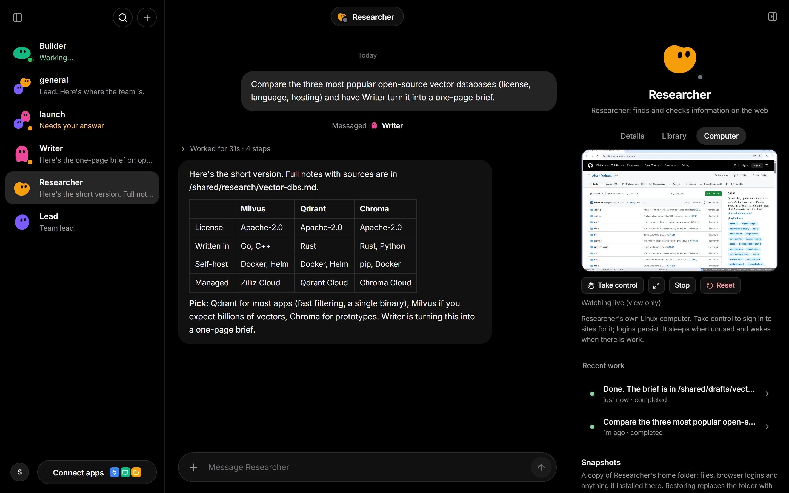
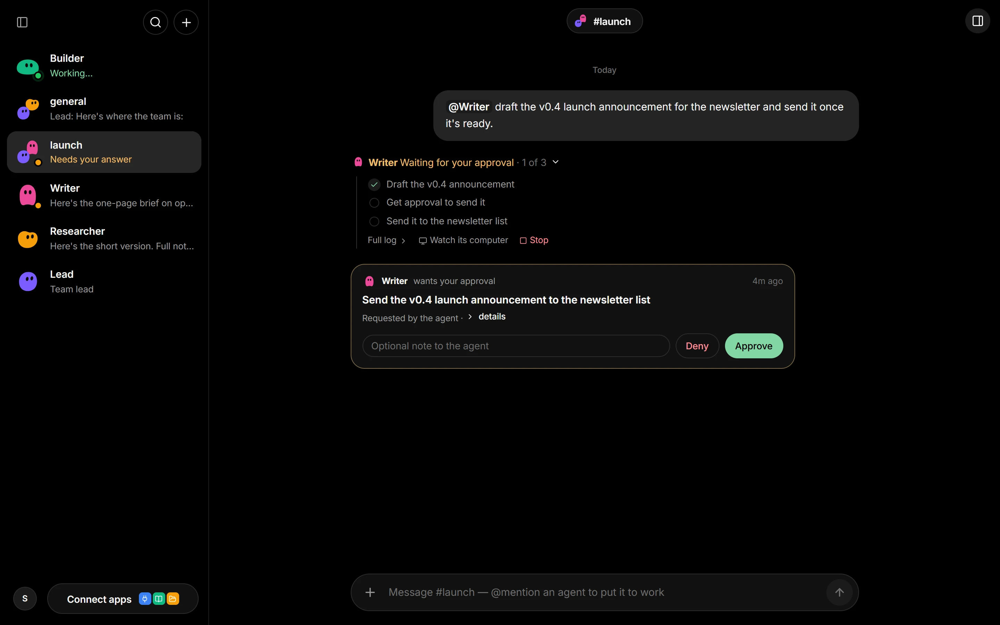
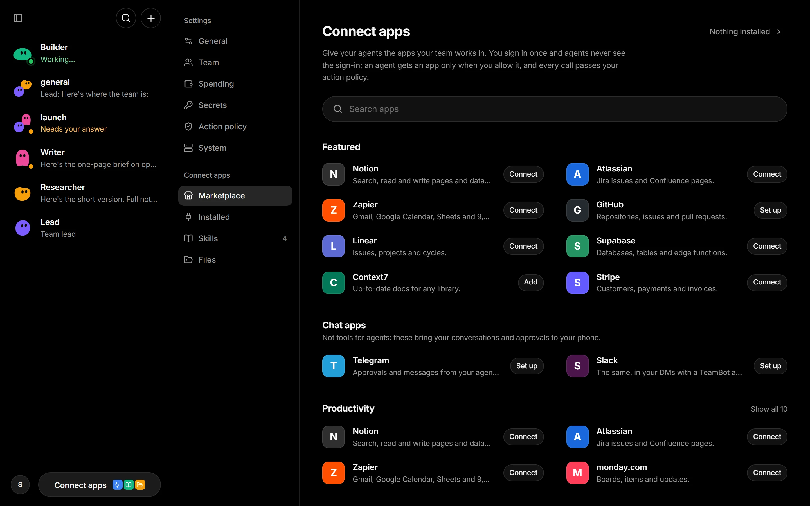
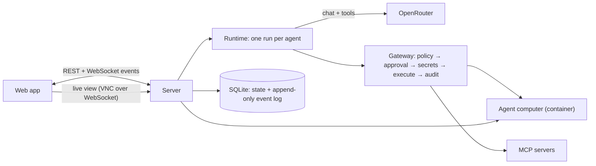

# TeamBot

**An open-source office for AI agents.** Every agent gets its own computer and its own model. Agents work with you and with each other in chats and channels, and they can't act without passing your rules.

TeamBot is a self-hosted take on products like xAI Grok Bot, OpenAI Dots and Manus Cue. Unlike them, each agent has a separate, isolated computer, you choose any model per agent through [OpenRouter](https://openrouter.ai), and everything runs on your machine. The research behind it is in [docs/FEATURE_MAP.md](docs/FEATURE_MAP.md).

For a detailed, code-based explanation of the architecture, agent communication, tools, computers, skills, memory, governance, and operations, read the [complete project guide](docs/PROJECT_OVERVIEW.md).

> Status: **P0 and P1 complete**, self-hosted, for one person or a small team. Read [Security model](#security-model) before you point agents at real accounts.



*Researcher compared three vector databases in its own browser (right, live), saved its notes to `/shared` and handed the write-up to Writer.*

## What you get

- **A team of named agents.** Each has a role, instructions and its own model (Claude, GPT, Gemini, Grok, DeepSeek, Qwen… anything on OpenRouter that supports tool calling). Agents do their own research and work, and message a teammate when that teammate's specialty fits. An agent can also propose a new permanent teammate for a specialty nobody covers: you approve it first, and it never gets more access or budget than the agent that proposed it.
- **A computer per agent.** It's an isolated Linux container with a terminal, files and a Chromium browser. You can **watch it live**, expand the screen to fill the window, and **take control** (to sign in, enter a 2FA code or solve a CAPTCHA), then hand it back. Logins persist. A **setup script** per agent installs its tools, an agent can run on its **own base image**, idle computers **go to sleep** and wake on the next task, and **snapshots** save and restore an agent's whole home folder. Turn on **full desktop control** for an agent to let it see the screen and use the mouse and keyboard in any app, and give it an **internet allowlist** to limit which sites it can reach.
- **Coding agents.** For substantial programming work, an agent can hand a task to Claude Code, Codex or Gemini CLI running inside its own computer (add the matching API key as a secret), then check the result.
- **Channels, DMs and threads.** Mention `@Name` to give an agent work, or reply in an agent's thread to keep talking to it. Attach files to any message (they land in `/shared/uploads`). A channel can have a **lead** agent that answers messages that mention nobody. Agents talk to each other the same way, and a loop guard stops endless agent-to-agent ping-pong.
- **Progress you can follow.** For any job with several steps, an agent writes its plan as a checklist and ticks it off as it works; the chat shows the step it is on, and the finished reply keeps the whole list. There is no task board: agents hand each other work by message, and you see "Messaged Job Scout" in your chat when they do.
- **Governance.** Every tool call passes a policy check: **allow / review / ask / deny / hand off**. By default, agents ask before clicking Send, Pay, Delete and similar buttons, hand password and card fields to you, and send risky shell commands to an independent **reviewer model** that approves, escalates to you, or blocks them. Rules can add [CEL](https://cel.dev) conditions (`when: "spend_today > 5.0"`, out-of-hours rules and so on). Approvals show up in the chat where the agent asked (marked in the conversation list) and on your phone.
- **Budgets.** Daily and monthly dollar caps and daily token caps per agent, plus a workspace-wide daily cap. Work over budget waits in the queue instead of running.
- **Prompt-injection defence.** Web pages, files, command output, MCP results and webhook bodies reach the model inside `<untrusted_content>` tags it is told never to take orders from.
- **Secrets kept out of prompts.** Secrets are encrypted at rest. Agents write `{{secret:NAME}}` in a tool argument, the server fills in the value at execution time, and it is scrubbed from text output; a screenshot taken by an action that used a secret is withheld. This keeps values out of transcripts and model calls by default, but it is not a sandbox: an agent allowed to use a secret in a shell command can deliberately transform and reveal it (`echo … | base64`), or show it on screen later. Give agents only the secrets they need, and use the policy (for example `ask` on `shell` with `args: { command: "secret:" }`) where that matters.
- **Skills.** Written procedures in the open `SKILL.md` format that agents load when a task calls for them, with any scripts or templates copied to their computer.
- **Memory you can read.** Each agent keeps lasting notes, plus a team memory every agent shares, as plain Markdown files you can edit in the app or on disk. **Search** finds anything said or done before, for you and for agents.
- **Durable runs.** Each step is saved, so runs survive restarts, pauses and long waits for approval. A tool that was interrupted mid-flight is reported as "interrupted", never silently re-run.
- **Audit log.** Every message, model call (tokens and cost), tool call, policy decision, review and approval is recorded. Each reply carries a short note of what the agent did, with the full step-by-step log one click away; the whole log is available from `/api/events`.
- **Routines.** Hand an agent a prompt on a cron schedule, or when something happens: a **webhook** call, a new **email** (any IMAP mailbox, including Gmail with an app password), a message in a **Slack channel**, or an upcoming **calendar event** (any iCal feed). Routines can follow a skill, and **read-only** routines can only look and report (for monitoring).
- **Connectors.** **Connect apps** is a marketplace of vendors' own MCP servers (Notion, GitHub, Linear, Atlassian, Zapier, Stripe, Supabase and about 30 more), plus any remote MCP server by its address. You sign in once in your browser (OAuth), or paste a token for servers like GitHub's; credentials are stored encrypted and refreshed automatically, and you switch on which agents get each app's tools on its page. Local MCP servers go in `mcp.json` (same format as Claude's `.mcp.json`).
- **Telegram and Slack.** Talk to your agents where you already are, get their messages to you, and approve or deny with a button.
- **Teams.** Use it alone, or turn on sign-in in **Settings → Team** and invite teammates with one-time links. Everyone shares the agents and group chats, direct messages stay private, and owners manage the policy, secrets, connectors and bridges.
- **OpenTelemetry.** Set `OTEL_EXPORTER_OTLP_ENDPOINT` to send the audit log as logs and each run as a trace to your observability stack.
- **A shared folder.** `/shared` is visible to every agent and under **Connect apps → Files**, where you can upload files too.

## Using the app

TeamBot works like a chat app. The sidebar lists your conversations, newest first: a chat with each agent, your group chats and, with team sign-in on, DMs with people. A chat that needs you is marked in amber. When agents message each other, your chat shows "Messaged Writer", and that link opens their conversation, which you can read but not post in.



*Writer drafted the newsletter and is waiting for approval before sending it. The checklist updates live as an agent works.*

Click the name at the top of a chat to open its details panel: the agent's status and routines, **Customize** (look, color, role, instructions, model, skills, budget, setup script and base image), **Memory**, its **Library** of shared files and its **Computer**. **Settings** (in the profile menu at the bottom left) and **Connect apps** share one page: General, Team, Spending, Secrets, Action policy and System on one side; Marketplace, Installed, Skills and Files on the other.



*Each app has its own page, where you sign in (or paste a token) and switch on which agents can use it.*

The interface is dark by default; switch to Light or Auto in **Settings → General** or the profile menu. It works on phones too. See [design.md](design.md) for the visual system and UI conventions.

## Quick start

You need **Node 22.13+**, **pnpm 10** and **Docker** (Docker Desktop on Windows/macOS).

```bash
pnpm install
pnpm computer:build          # builds the agent computer image (~2 GB, a few minutes the first time)
cp .env.example .env         # then put your OPENROUTER_API_KEY in .env
pnpm build                   # builds the web app
pnpm start                   # → http://127.0.0.1:8787
```

Click **Create starter team** to add Lead, Researcher and Writer, then try:

> @Lead research the three most popular open-source vector databases and have the Writer turn it into a one-page comparison in /shared

**Development:** `pnpm dev` runs the server on :8787 with reload and Vite on :5173 (open :5173).

### Self-host with Docker only

```bash
docker build -t teambot/computer:latest ./computer
docker compose up -d --build   # → http://127.0.0.1:8787  (set TEAMBOT_PORT to change)
```

Put your settings in `.env` next to `docker-compose.yml`. Data lives in the `teambot-data` and `teambot-shared` volumes.

## How it works



- **Runtime** (`apps/server/src/runtime`): an agent's inbox (mentions, DMs, thread replies, teammates' messages, routines, webhooks) becomes a *run*. Each step checks the agent's budget, then calls its model with a fresh system prompt (team roster, skills, memory, available secret names). New messages that arrive mid-run are folded into the same run. Long runs are compacted with a cheap utility model.
- **Gateway** (`runtime.ts` → `handleCall`): it validates arguments, collects facts (for a click, which button and on which site), evaluates the policy, asks the reviewer model when a rule says `review`, and pauses for a human when needed. It fills in secrets, executes, scrubs the output, tags outside content as untrusted and records everything.
- **Computers** (`computer/`): Debian with Xvfb, Fluxbox, Chromium (driven over CDP so you see what the agent does), x11vnc and `computerd`, a small authenticated tool API. There is one container plus one disk volume per agent.
- **Policy** (`apps/server/src/policy.ts`): YAML you can edit in **Settings**. Rules match on tool, agent, initiator (human / agent / schedule / event), domain, the target element's label, field type and arguments. The strictest match wins.
- **Plain files** in `data/`: `skills/<name>/SKILL.md`, `memory/team.md` and `memory/agents/<Name>.md`, next to the SQLite database and `shared/`.

## Configuration

All settings are environment variables (see [.env.example](.env.example)):

| Variable | Default | |
|---|---|---|
| `OPENROUTER_API_KEY` | (none) | Required. |
| `TEAMBOT_DEFAULT_MODEL` | `anthropic/claude-sonnet-5.5` | Model for new agents. |
| `TEAMBOT_UTILITY_MODEL` | `openai/gpt-6-luna` | Cheap model used to summarize long runs. |
| `TEAMBOT_REVIEWER_MODEL` | the utility model | Model that judges actions sent to it by `review` policy rules. |
| `TEAMBOT_USER_NAME` | `Owner` | Your name in a new workspace (change it later in **Settings → General**). |
| `PORT` / `HOST` | `8787` / `127.0.0.1` | |
| `TEAMBOT_DATA_DIR` | `./data` | SQLite DB, master key, `shared/`, `skills/`, `memory/`. |
| `TEAMBOT_COMPUTER_IMAGE` | `teambot/computer:latest` | Image for agent computers (an agent can also have its own on its **Customize** page). |
| `TEAMBOT_SANDBOX_RUNTIME` | (runc) | Set `runsc` to run computers under gVisor (Linux hosts). |
| `TEAMBOT_COMPUTER_MEMORY_MB` / `_CPUS` | `2048` / `2` | Per-agent limits. |
| `TEAMBOT_COMPUTER_IDLE_MINUTES` | `30` | Stop a computer nobody has used for this long (`0` keeps them running). |
| `TEAMBOT_MAX_STEPS_PER_RUN` | `40` | Model calls per run before the agent stops and asks. |
| `TEAMBOT_MAX_CONCURRENT_RUNS` | `4` | Agents working at the same time. |
| `TEAMBOT_COMPACT_AT_TOKENS` | `60000` | Transcript size at which a run's older steps are summarized by the utility model. |
| `TEAMBOT_MAX_AGENT_DEPTH` | `6` | Agent-to-agent hops allowed without a human. |
| `TEAMBOT_OFFLINE_MODELS` | (off) | `1` makes every agent answer with a canned echo, for trying the app without a key or cost. |
| `TEAMBOT_MASTER_KEY` | auto-generated | 32-byte base64 key for secrets (otherwise `data/master.key`). |
| `TEAMBOT_PUBLIC_URL` | (none) | The address people open TeamBot at when it isn't this machine, e.g. `https://teambot.example.com`. Used for connector sign-in callbacks and secure cookies. |
| `TEAMBOT_MCP_CONFIG` | `mcp.json` | Where to read local MCP servers from. |
| `TEAMBOT_EGRESS_PORTS` | `18800-18999` | Ports for the per-agent egress proxies (agents with an internet allowlist). `TEAMBOT_EGRESS_BIND` / `TEAMBOT_EGRESS_HOST` set where the proxy listens and how computers reach it; the defaults work on the host and in Docker Compose. |
| `OTEL_EXPORTER_OTLP_ENDPOINT` | (off) | OTLP/HTTP endpoint for logs and traces. `OTEL_EXPORTER_OTLP_HEADERS` and `OTEL_SERVICE_NAME` work as usual. |

Budgets (per agent on its **Customize** page, and a workspace cap in **Settings**) are stored in the database, not in environment variables.

## Security model

Be clear-eyed about what this MVP does and doesn't protect against.

- **Sign-in is off until you turn it on.** A personal workspace has no login and binds to `127.0.0.1`: whoever can open the page acts as you. Before anyone else can reach it, turn on team sign-in in **Settings → Team** and put TeamBot behind HTTPS (a reverse proxy) with `TEAMBOT_PUBLIC_URL` set. Passwords are stored as scrypt hashes, sessions are HttpOnly SameSite cookies, invite links work once, repeated failed sign-ins are paused, and the server refuses changes that a browser says came from another site. The server warns at startup if it listens beyond this machine without sign-in.
- **Teammates share the agents.** Any member can give any agent work, and agents' work logs are visible to the whole team. Only direct messages between a person and others are private. Members can't change the policy, secrets, connectors, bridges, the workspace spending cap or the team.
- **The server controls Docker,** which makes it privileged on the host.
- **Per-agent isolation is a container boundary.** Agents can't see each other's disks or logins. For a stronger boundary on Linux, install gVisor and set `TEAMBOT_SANDBOX_RUNTIME=runsc`. Chromium runs with `--no-sandbox` *inside* the container.
- **Agents have open internet access unless you restrict them.** Give an agent an allowlist on its **Customize** page and its computer is firewalled so it can only connect through its own egress proxy, which lets through the listed domains and refuses the rest. Beyond that, the policy is your guardrail: it reliably catches clicks on buttons labelled Send, Pay, Delete and so on, and password fields, and the reviewer model looks at risky shell commands and team-memory changes, but neither can understand every action. Keep agents away from accounts where a mistake is expensive.
- **Connector and bridge tokens** (OAuth tokens, bot tokens, mailbox passwords, private calendar URLs) are stored as reserved secrets: encrypted like other secrets, never shown to agents and not usable in `{{secret:...}}`. Connector tools count as external actions, so by default every call asks you first.
- **Untrusted content is tagged, not neutralised.** Tool output from outside the team is wrapped in `<untrusted_content>` and the model is told to treat it as data. That lowers the risk of prompt injection; it does not remove it. The policy and the reviewer are the backstop.
- **Webhooks** are protected by a per-routine secret token. TeamBot still listens on `127.0.0.1`, so an outside service needs a tunnel or proxy that you control to reach `/api/hooks/...`.
- **Setup scripts** are written by you and run with the agent's sudo rights on its own computer, outside the policy check.
- **Secrets** are AES-256-GCM encrypted with a key in `data/master.key` (keep it safe), and they never enter model context.

## Project layout

```
apps/server     Fastify API, runtime, policy, vault, Docker computers, MCP (TypeScript, run with tsx)
apps/web        React + Vite web app
packages/shared Types shared by server and web
computer/       The agent computer image and computerd (its tool API)
docs/           Research and the feature map / roadmap
```

## Tests

```bash
pnpm test                                                  # unit + runtime tests (scripted model, fake computer)
TEAMBOT_DOCKER_TESTS=1 pnpm --filter @teambot/server test  # plus an end-to-end run on a real agent computer
```

## Roadmap

See [docs/FEATURE_MAP.md](docs/FEATURE_MAP.md). P0 and P1 are done; next is P2: agents talking to outside agents (A2A), agent identities, learning skills by demonstration, a plugin marketplace (skills, apps and agent templates) with vetting, SSO and finer roles.

## Contributing

Contributions are welcome! Please see [contributions.md](contributions.md) for local development setup, architectural invariants, coding conventions, and PR guidelines.

## License

[Apache-2.0](LICENSE)
