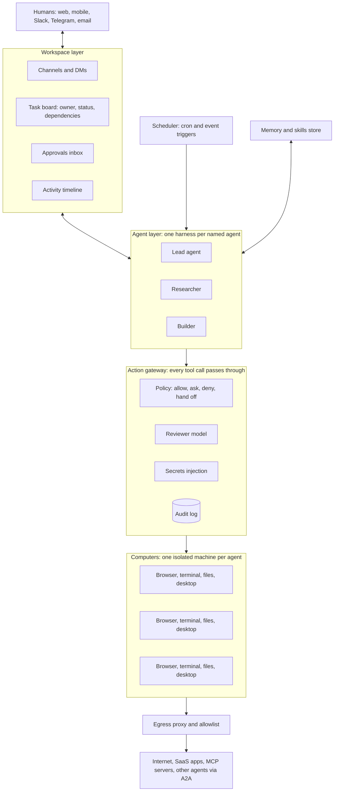

# TeamBot feature map

*What the "AI teammates with their own computer" products do as of 2026-10-01, and what an open-source version should build, in what order.*
*Evidence and sources: [research/landscape.md](research/landscape.md).*

**Legend:** ✅ offered and documented · ◐ partial or limited · ✗ not offered, or not documented
**Priority for TeamBot:** **P0** MVP · **P1** first real release · **P2** teams and ecosystem · **P3** frontier

**Column key:** Grok = xAI Grok Bot · Dots = OpenAI Dots · Cue = Manus Cue · Muse = Meta Muse · OB-NL = nightly-labs/openbot · OB-CK = CopilotKit/OpenBot · Claw = OpenClaw · Hermes = Nous Hermes Agent

---

## 0. The shape of the product

Every product in this category is built from the same seven layers. The matrix below is organised by them.

---

## 1. Feature matrix

### A. Agents and identity

| Feature | Grok | Dots | Cue | Muse | OB-NL | OB-CK | Claw | Hermes | **TeamBot** |
|---|---|---|---|---|---|---|---|---|---|
| Multiple named agents per user | ✅ | ◐ one at launch | ✅ | ✗ one agent + subagents | ✅ | ✅ | ◐ | ✗ | **P0** |
| Role, instructions and avatar per agent | ✅ | ◐ | ✅ | ✗ | ✅ | ✅ | ✅ | ◐ | **P0** |
| Pick the model per agent (BYO, local) | ✗ | ✗ | ✗ | ✗ | ✅ | ✅ | ✅ | ✅ | **P0** |
| Agent's own identity (email, phone, accounts) | ✗ acts as you | ◐ Specialist Dots | ✅ email, phone, wallet | ✗ | ✗ | ◐ own logins | ✗ | ✗ | **P2** |
| Agent templates, sharing, marketplace | ✅ Team Bots | ✗ | ✗ | ✗ | ✅ | ◐ | ◐ skill hub | ✗ | **P2** |

### B. The agent's computer

| Feature | Grok | Dots | Cue | Muse | OB-NL | OB-CK | Claw | Hermes | **TeamBot** |
|---|---|---|---|---|---|---|---|---|---|
| Dedicated, always-on machine | ◐ one per *user*, shared | ✅ per dot | ✅ per agent | ✅ per user | ✗ your PC | ✅ per bot | ✗ your PC or server | ◐ 5 backends | **P0** (per agent) |
| Real isolation between agents | ✗ explicitly not | ✅ | ✅ | n/a | ✗ full access | ✅ Docker + gVisor | ✗ | ◐ | **P0** |
| Browser with persistent logins | ✅ | ✅ | ✅ | ✅ | ✅ | ✅ | ✅ | ✅ | **P0** |
| Terminal and filesystem | ✅ | ◐ | ✅ | ✅ | ✅ | ✅ | ✅ | ✅ | **P0** |
| Full GUI desktop (computer use) | ✅ | ✅ | ✅ | ◐ browser | ◐ via cua-driver | ◐ browser | ◐ | ◐ | **P1** |
| Watch the agent's screen live | ✅ | ✅ | ✗ | ✗ | ✅ | ✅ | ✗ | ✗ | **P0** |
| Human takeover for logins, 2FA, CAPTCHA | ✅ | ✅ hand-off | ✗ | ◐ | ◐ | ✅ take the wheel | ✗ | ✗ | **P0** |
| State survives restarts | ✅ | ✅ | ✅ | ✅ | ✅ | ✅ | ✅ | ✅ | **P0** |
| Opt-in bridge to the user's own machine | ✅ ask every time | ✅ | ◐ Manus remote | ✗ | ✅ it *is* local | ✗ | ✅ | ✅ | **P2** |
| Setup scripts and base images | ✅ Team Setup | ✗ | ✗ | ✗ | ✗ | ◐ Dockerfile | ◐ | ◐ | **P1** |
| Lifecycle: sleep, snapshot, idle auto-terminate | ◐ 30-day | ✗ | ✗ | ✗ | ✗ | ◐ | ✗ | ✗ | **P1** |

### C. Agent ↔ agent collaboration

| Feature | Grok | Dots | Cue | Muse | OB-NL | OB-CK | Claw | Hermes | **TeamBot** |
|---|---|---|---|---|---|---|---|---|---|
| Direct messages between agents | ✅ | ✗ | ✅ | ◐ subagents | ✅ | ✗ | ✗ | ✗ | **P0** |
| Group channels shared by agents and humans | ✅ | ◐ Space | ✅ | ✗ | ✅ | ✗ | ✗ | ✗ | **P0** |
| Explicit task ownership, hand-off, reassign | ✅ | ✗ | ✅ | ✗ | ✅ | ✗ | ✗ | ✗ | **P0**; removed 2026-10-02 (hand-offs by message) |
| Shared task board with dependencies | ✗ | ✗ | ✗ | ✗ | ◐ queues | ✗ | ✗ | ✗ | **P0** (Claude Agent Teams model); removed 2026-10-02 for per-run progress checklists |
| Lead or chief-of-staff agent | ✅ | ✗ | ◐ | ◐ orchestrator | ◐ | ✗ | ✗ | ✗ | **P1** |
| Spawn short-lived sub-agents or workers | ✅ Cloud Agents | ✅ Codex | ✗ | ✅ | ◐ via CLIs | ✗ | ◐ | ◐ | **P1**; removed 2026-10-02 (agents work alone or ask a specialist teammate) |
| Shared files and artifact hand-off | ✅ shared VM | ✅ Space | ✗ | n/a | ✅ transfer manifests | ◐ | ◐ | ◐ | **P0**; ✅ 2026-10-05: files an agent names arrive as cards with live previews (web pages, documents, code, slides, sheets, PDFs) |
| Talk to agents on *other* platforms (A2A) | ✗ | ✗ | ✗ | ✗ | ✗ | ✗ | ✗ | ✗ | **P2** (nobody has it) |

### D. Human ↔ agent collaboration

| Feature | Grok | Dots | Cue | Muse | OB-NL | OB-CK | Claw | Hermes | **TeamBot** |
|---|---|---|---|---|---|---|---|---|---|
| Coworker-style chat, synced across devices | ✅ | ✅ | ✅ | ✅ | ✅ | ✅ | ✅ | ✅ | **P0** |
| Approvals inbox and notifications | ✅ | ✅ | ✅ | ✅ | ✗ | ✅ | ◐ | ◐ | **P0** |
| Activity timeline of background work | ◐ | ✅ Activity View | ✗ | ✗ | ◐ | ✅ | ◐ | ◐ | **P0** |
| Lives in Slack, Teams, WhatsApp, Telegram | ✗ | ✅ Slack, Teams | ✗ | ✅ WhatsApp | ✗ | ✗ | ✅ ~29 apps | ✅ 7+ | **P1** |
| Proactive check-ins and follow-ups on stalled work | ✅ | ✅ | ✗ | ✅ | ✗ | ✗ | ✅ heartbeat | ◐ | **P1**; follow-ups on tasks removed with the board |
| Several humans in one workspace | ✅ Teams | ✅ Space | ✗ | ✗ | ✅ WebRTC | ◐ | ✗ | ✗ | **P1** |
| Docs co-edited by humans and agents (@mention, comments) | ✗ | ✅ Pages | ✗ | ✗ | ✗ | ◐ | ✗ | ✗ | **P2**; ✅ pages with revision checks and review before saving built 2026-10-04 (comments not yet) |
| Rich or generative UI in replies | ✗ | ✅ | ✗ | ✗ | ◐ | ✅ | ✗ | ✗ | ✅ built 2026-10-04: sandboxed components and one-off interfaces, inline tool cards |
| Native mobile app | ✅ iOS | ✅ | ✅ | ✅ | ◐ Expo | ✗ | via chat apps | via chat apps | **P2** (a messaging bridge covers it first) |
| Phone or voice | ✗ | ◐ coming | ✅ | ◐ glasses coming | ✗ | ✗ | ✗ | ✗ | **P3** |

### E. Work engine and autonomy

| Feature | Grok | Dots | Cue | Muse | OB-NL | OB-CK | Claw | Hermes | **TeamBot** |
|---|---|---|---|---|---|---|---|---|---|
| Keeps working while you're offline | ✅ | ✅ | ✅ | ✅ | ◐ while app is open | ✅ | ✅ if hosted | ✅ | **P0** |
| Durable queue: pause, resume, cancel, crash-safe | ✅ | ✅ | ✗ | ✗ | ✅ | ◐ | ◐ | ◐ | **P0** |
| Scheduled jobs (cron) | ✅ | ✅ | ✅ | ✅ | ✗ | ◐ | ✅ | ✅ | **P0** |
| Event triggers: email, Slack, webhook, calendar | ✅ | ✅ | ✅ | ✗ | ✗ | ✗ | ✅ | ✗ | **P1** |
| Read-only monitoring when idle | ◐ | ✅ read-only tools | ✗ | ✅ | ✗ | ✗ | ✅ heartbeat | ✗ | **P1** |
| Context compaction for long jobs | ✗ | ✗ | ✗ | ✗ | ✅ | ✗ | ✅ | ✅ | **P0** |
| Goal or rubric self-check ("outcomes") | ✗ | ◐ PR + demo video | ✗ | ✗ | ✗ | ✗ | ✗ | ✗ | **P2** |
| Several models per task (routing) | ✗ | ✗ | ✗ | ✗ | ◐ per agent | ◐ | ◐ | ◐ | **P2** |

### F. Skills, memory and learning

| Feature | Grok | Dots | Cue | Muse | OB-NL | OB-CK | Claw | Hermes | **TeamBot** |
|---|---|---|---|---|---|---|---|---|---|
| Reusable skills (written procedures) | ✅ | ✗ | ✗ | ✗ | ✅ | ✗ | ✅ SKILL.md | ✅ | **P1** (SKILL.md format) |
| Routines (skill + agent + trigger) | ✅ max 50 | ◐ automations | ✅ automations | ◐ cron | ✗ | ✗ | ✅ | ✅ | **P1** |
| Learn by watching you (screen recording) | ✅ up to 10 min | ✗ | ✗ | ✗ | ✗ | ✗ | ✗ | ✗ | **P2** |
| Agent writes and patches its own skills | ✗ | ✗ | ✗ | ✗ | ✗ | ✗ | ✗ | ✅ | **P2** (behind human review) |
| Long-term memory of preferences | ✅ | ✅ | ✗ | ✅ | ◐ per CLI | ✗ | ✅ | ✅ Honcho | **P1** |
| Memory you can **inspect, edit and delete** | ✗ (main criticism) | ◐ | ✗ | ◐ "forget" | ◐ | ✗ | ✅ plain files | ✅ | **P1** |
| Search across past sessions | ✗ | ◐ | ✗ | ✗ | ✗ | ◐ | ◐ | ✅ FTS5 | **P1** |

### G. Integrations

| Feature | Grok | Dots | Cue | Muse | OB-NL | OB-CK | Claw | Hermes | **TeamBot** |
|---|---|---|---|---|---|---|---|---|---|
| Browser as universal integration (no API needed) | ✅ | ✅ | ✅ | ✅ | ✅ | ✅ | ✅ | ✅ | **P0** |
| MCP servers | ✅ public only | ◐ | ✗ | ✗ | ✅ | ◐ | ✅ | ✅ | **P0** |
| OAuth app connectors | ✅ ~8 built-in | ✅ ~4,000 | ✅ | ✅ | ✅ plugins | ✗ | ✅ | ✅ | **P1** |
| Delegate to coding agents (Claude Code, Codex, Cursor) | ✅ | ✅ Codex | ✗ | ✗ | ✅ core idea | ◐ via AG-UI | ◐ | ✗ | **P1** |
| Payments: virtual cards, budgeted wallet | ✗ hands off | ✗ hands off | ✅ wallet | ✅ Stripe Link | ✗ | ✗ | ✗ | ✗ | **P3** |

### H. Safety and governance

| Feature | Grok | Dots | Cue | Muse | OB-NL | OB-CK | Claw | Hermes | **TeamBot** |
|---|---|---|---|---|---|---|---|---|---|
| Per-action rules: allow, ask, deny, hand off | ✅ 3 tiers | ✅ 4 tiers | ◐ budget only | ✅ | ✗ by design | ✅ CEL | ◐ | ◐ | **P0** |
| Secrets never shown to the model | ✅ | ✅ | ✗ | ✅ | ✗ | ✅ write-only | ✗ plaintext at rest | ✗ | **P0** |
| Audit log of every action | ✅ + OTel (enterprise) | ✅ | ✗ | ✗ | ◐ command log | ✅ ledger | ◐ | ◐ | **P0** |
| Global pause or kill switch | ◐ | ✅ auto-pause | ✗ | ◐ | ✅ Stop | ✗ | ✗ | ✗ | **P0** |
| Deterministic policy engine that fails closed | ◐ rules | ◐ | ✗ | ◐ | ✗ | ✅ | ✗ | ✗ | **P0** simple rules, **P1** CEL |
| Independent reviewer model on risky actions | ✅ Auto Review | ✅ always on | ✗ | ✅ Sentinel | ✗ | ✗ | ✗ | ✗ | **P1** |
| Network egress control | ✅ allowlists | ✗ | ✗ | ✅ Sentinel gates all | ✗ | ✅ loopback-first | ✗ | ✗ | **P1** |
| Untrusted content tagged (prompt-injection defence) | ✅ | ◐ | ✗ | ✅ | ✗ | ✗ | ✗ | ✗ | **P1** |
| Spend and usage budgets per agent | ◐ weekly usage | ◐ | ✅ wallet cap | ✗ | ✗ | ✗ | ✗ | ✗ | **P1** |
| Skill and plugin vetting | ✗ | ✗ | ✗ | ✗ | ✗ | ✗ | ✗ (malicious-skill incident) | ✗ | **P2** |
| Signed, tamper-evident action history | ✗ | ✗ | ✗ | ✗ | ✗ | ✗ | ✗ | ✗ | **P3** (Block Buzz does this) |

### I. Teams, admin and openness

| Feature | Grok | Dots | Cue | Muse | OB-NL | OB-CK | Claw | Hermes | **TeamBot** |
|---|---|---|---|---|---|---|---|---|---|
| Self-hostable | ✗ | ✗ | ✗ | ✗ | ✅ local | ✅ | ✅ | ✅ | **P0** |
| Multi-user teams with shared agents | ✅ | ✅ | ✗ | ✗ | ✅ | ◐ | ✗ | ✗ | **P1** |
| OpenTelemetry export | ✅ | ✗ | ✗ | ✗ | ✗ | ✗ | ✗ | ✗ | **P1** |
| SSO, SCIM, RBAC | ✅ | ✅ | ✗ | ✗ | ✗ | ✗ | ✗ | ✗ | **P2** |
| Org rules members can't loosen | ✅ | ✅ | ✗ | ✗ | ✗ | ◐ | ✗ | ✗ | **P2** |
| Team secrets and shared setup scripts | ✅ | ✗ | ✗ | ✗ | ✗ | ◐ | ✗ | ✗ | **P2** |
| Admin API | ✅ | ✗ | ✗ | ✗ | ✗ | ✗ | ✗ | ✗ | **P2** |
| License | closed | closed | closed | closed | **PolyForm Noncommercial** | MIT | MIT | MIT | **Apache-2.0** |

---

## 2. Where the market leaves a gap

No single product, open or closed, covers all six of these:

1. **Real per-agent isolation.** Grok Bot shares one VM across all your bots. nightly OpenBot gives agents full access to your PC. OpenClaw has no sandbox by default. Only CopilotKit OpenBot isolates per bot, and it has no team collaboration layer.
2. **Any model, per agent.** Grok and Dots lock you to their models. Mixing Claude, GPT, Grok and local models in one team is a real draw.
3. **A truly open license.** The closest product to "team of agents on your PC" (nightly OpenBot) moved to *noncommercial*. An Apache-2.0 version of that idea has no direct competitor.
4. **Team-native collaboration as a first-class object.** Channels, DMs, a task board with owners and dependencies, and hand-offs. The closed products have it, but no open one has it together with isolation and governance.
5. **Memory and skills you can read.** Grok Bot's opaque memory is its most-cited complaint. Plain-file memory and SKILL.md (OpenClaw, Hermes style) inside a governed, isolated runtime is unclaimed.
6. **Cross-vendor agent teams over A2A.** None of the products documents it. TeamBot agents could expose A2A Agent Cards and accept tasks from, or delegate to, outside agents.

**Suggested one-line positioning:** *"An open-source office for AI agents. Every agent gets its own computer and its own model, works with the team in channels and on a task board, and can't act without passing your rules."*

---

## 3. Recommended architecture (decisions, not options)

| # | Decision | Recommendation | Why |
|---|---|---|---|
| 1 | Computer per **agent** or per **user**? | **Per agent**, with an opt-in shared volume (`/shared`) for hand-offs | This is Grok Bot's biggest weakness. Per-agent containers give a real blast-radius boundary, and the shared volume keeps hand-off simple. |
| 2 | Sandbox tech | **Docker + gVisor (`runsc`) by default**, behind a `ComputerProvider` interface. Add E2B, Cua and Firecracker drivers later. | Runs on any Linux box or laptop today. The interface keeps cloud and microVM backends a driver away. |
| 3 | What's inside a computer | Ubuntu 24.04 + XFCE + Chromium (CDP on loopback) + **noVNC or KasmVNC** for live view and takeover + a small **computer daemon** exposing shell, files, browser and screenshot tools over an authenticated local socket | Live view and takeover come almost free with VNC. The daemon is the only thing the gateway talks to. |
| 4 | Agent brain | Your **own thin harness** (tool loop, compaction, MCP client) with provider adapters: Anthropic, OpenAI, and any OpenAI-compatible endpoint (OpenRouter, Ollama, vLLM). **Plus an adapter that runs Claude Code, Codex or Gemini CLIs *inside* the agent's computer as a tool** (via ACP) | You own the loop, approvals and audit, and still get the best coding agents and "use the plan you already pay for". |
| 5 | Collaboration model | Slack-like workspace where **humans and agents are both "members"**. Channels, DMs and threads, plus a **Task** object (owner, status, dependencies, artifacts). Agents get tools like `post_message`, `create_task`, `claim_task`, `handoff_task` and `request_approval`. | Matches Grok Bot and Cue group chats and the Claude Agent Teams task-list and mailbox model. Members being the same kind of thing is the Block Buzz insight. |
| 6 | Source of truth | An **append-only event log** (every message, tool call, approval and state change) next to the state tables. *SQLite built into Node 22 (no extra service, tests run in memory). It also serves P1's small-team mode on one server; move to Postgres with SSO in P2.* | One log gives you the audit trail, Activity view, replay and debugging. nightly OpenBot and Buzz both do this. |
| 7 | Governance | **Every tool call goes through the gateway:** match rules (tool, args, domain, path, initiator) → **allow / ask / deny / hand off** → optional reviewer-model check → run → audit. **Fail closed.** "Ask" beats "allow" on conflict. | The Dots, Grok and CopilotKit designs converge here. Start with YAML rules and upgrade to CEL. |
| 8 | Secrets | Encrypted vault. The model only ever sees placeholders (`{{secret:GITHUB_TOKEN}}`), and the **gateway injects real values at execution time**. A "secure secret request" UI for humans. | Muse, Dots and Grok all keep secrets away from the model. OpenClaw's plaintext secrets are the counter-example. |
| 9 | Network | Each computer's traffic is forced through an **egress proxy** with per-agent domain allowlists. | A lightweight version of Muse's Sentinel and Grok's Network Controls. It also stops data exfiltration by prompt injection. |
| 10 | Protocols | **MCP** for tools · **AG-UI** for streaming to the UI · **A2A** endpoint and Agent Card per agent (P2) · **SKILL.md** for skills | Open, AAIF-governed and interoperable. Being the first agent team that speaks A2A is a differentiator. |
| 11 | Deployment | **Server-first:** `docker compose up` on a home server, VPS or laptop, with a web UI. A desktop wrapper comes later. | Agents that work 24/7 and need their own computers belong on a box that stays on. Local-first desktop (nightly OpenBot) stops when the laptop closes. |
| 12 | Stack | **TypeScript monorepo**: Fastify API and gateway, React + Vite web app, own harness, SQLite to start. Computer daemon in TS (Playwright over CDP). | MCP, AG-UI and A2A all have first-class TS SDKs, and both OpenBots are TS, so you can borrow patterns. Python is also viable if you prefer it (see open decisions). |

---

## 4. Build roadmap

### P0: MVP, "a team in a box" (single user, self-hosted) ✅ built

*Built on 2026-10-01; see the [README](../README.md). Message threads and file attachments, missing from the first build, were added during the P0 review on 2026-10-01, along with fixes for two screens that crashed (Routines tab, New task dialog), dialogs that ignored their first field, and partial agent and routine updates that reset other fields. Not yet in it: MCP servers are connected on the host rather than inside each computer, and "Always allow" from an approval is not offered (edit the policy instead). Postgres was replaced by SQLite (decision 6). Since the [redesign](#redesign-a-grok-style-chat-workspace-2026-10-02--built) the approvals inbox, Activity timeline and task board are no longer pages of their own: approvals and work notes sit in the conversation they belong to. The task board itself was removed later that day ([see below](#no-task-board-progress-checklists-2026-10-02--built)).*

1. `docker compose up` brings up the API, web UI, Postgres, scheduler and computer pool.
2. **Agent roster:** create named agents with a role, instructions, avatar and **model of your choice**.
3. **Per-agent computer:** an isolated container (gVisor) with terminal, filesystem and Chromium. **Live view in the UI** with **takeover** for logins and 2FA.
4. **Workspace:** channels and DMs with humans and agents as members, threads, and file attachments plus a `/shared` hand-off volume.
5. **Task board:** create, claim and hand off tasks, with owner, status and dependencies. A lead agent can break a goal into tasks.
6. **Durable runs:** per-agent queue with pause, resume and cancel, crash-safe resume, context compaction and runs that continue while you're offline.
7. **Governance v1:** YAML rules (allow / ask / deny / hand off), an **approvals inbox**, a global **pause-all**, and secrets vault plus injection.
8. **Activity timeline and audit log** from the event log.
9. **MCP client** and **cron schedules**.

**MVP acceptance demo:** Create *Lead*, *Researcher* and *Writer* in `#launch`. Post a goal. Lead creates three tasks with dependencies. Researcher browses in its own computer while you watch live. Writer drafts in `/shared` and asks approval before sending an email. You approve in the chat where it asked. Every step shows in the audit log.

### P1: "a coworker you can trust" (first public release) — done

- **Governance v2:** CEL policies, **reviewer model** (auto-review), **egress proxy and allowlists**, untrusted-content tagging, per-agent spend and token budgets.
- **Skills (SKILL.md) and Routines** (skill + agent + schedule or event trigger).
- **Event triggers:** webhook, email (IMAP or Gmail), Slack message, calendar.
- **Proactive mode:** read-only monitoring when idle, plus follow-ups on stalled tasks.
- **Memory:** long-term preferences as **plain, editable files**, plus search across past sessions.
- **Messaging bridges:** Slack and Telegram first. Talk to your agents where you already are, and approve from your phone.
- **Full GUI desktop** computer use, base images and setup scripts, sleep/snapshot and idle shutdown.
- **Coding-agent adapter:** run Claude Code, Codex or Gemini CLI inside an agent's computer.
- **Multi-user workspace** (invite teammates) and **OpenTelemetry** export.
- From the matrix: a **lead agent** per channel.

**Progress (2026-10-02): all P1 items are done.**

| Item | Status |
|---|---|
| Reviewer model | ✅ `review` policy action; fails closed to asking a human. Default rules send risky shell commands, coding-agent tasks and team-memory changes to it. |
| Untrusted-content tagging | ✅ Browser, file, shell, MCP, webhook, email, Slack and calendar content is wrapped in `<untrusted_content>`. |
| Spend and token budgets | ✅ Daily/monthly USD and daily token caps per agent, plus a workspace daily cap. |
| CEL policies | ✅ Optional `when:` on any rule (CEL via `@marcbachmann/cel-js`): tool, risk, agent, initiator, domain, args, time of day, weekday and spend today. A broken expression is rejected on save; one that fails at run time makes restrictive rules match and allow rules not (fails closed). |
| Egress proxy and allowlists | ✅ Per agent: open, or an allowlist of domains. Restricted computers are firewalled (iptables, set from outside the container) so their own proxy port is the only way out; blocked requests show up under Blocked sites in the Computer tab of the agent's panel. Works with the server on the host or in Docker Compose. |
| Skills (SKILL.md) | ✅ Files in `data/skills`, editor under Connect apps → Skills, per-agent access, supporting files copied to the computer. |
| Routines with skill and trigger | ✅ Cron, webhook, email, Slack and calendar triggers, optional skill, read-only mode. |
| Event triggers | ✅ Webhooks; email over IMAP (Gmail with an app password), with attachments saved to `/shared`; messages in a Slack channel; upcoming events in any iCal feed (recurring events and time zones handled). Passwords and private feed URLs are reserved secrets. |
| Proactive mode | ✅ Read-only routines for monitoring. (Follow-ups on quiet tasks went with the task board on 2026-10-02.) |
| Memory as editable files | ✅ `data/memory/team.md` and `data/memory/agents/<Name>.md`, `remember`/`forget` tools, editor in the app. |
| Search across past sessions | ✅ Messages, for humans (Search page) and agents (`search_history`). |
| Lead agent | ✅ A channel's lead answers messages that mention nobody. |
| Base images, setup scripts, sleep/snapshot, idle shutdown | ✅ Per-agent image and setup script; idle computers sleep; snapshots save and restore an agent's home folder. |
| Messaging bridges | ✅ Telegram (bot token, pairing code) and Slack (Socket Mode app from a manifest): DMs with agents, approvals with buttons, files both ways. |
| Full GUI desktop computer use | ✅ Opt-in per agent: screenshots plus mouse and keyboard tools on the whole desktop (xdotool), with clicks described to the policy by what is under the pointer. Every agent on a model that accepts images also has `browser_screenshot`, to read charts and tables that pages draw as images. |
| Coding-agent adapter | ✅ `run_coding_agent` runs Claude Code, Codex or Gemini CLI inside the agent's computer, offered when its API key is a stored secret; the key goes to the CLI's environment only. |
| Independent work and specialist collaboration | ✅ Temporary helper spawning removed. Agents research and execute independently by default, requesting help from an existing teammate only when its stated specialty fits the task. |
| OAuth app connectors | ✅ Remote MCP servers added under Connect apps with OAuth sign-in (discovery, dynamic client registration, PKCE and refresh via the MCP SDK), or with a pasted token sent in a header (GitHub). A marketplace lists about 35 vendors' own servers, checked to accept TeamBot's sign-in; anything else is added by URL. Credentials are reserved secrets; each app's page switches agents on or off, and calls default to `ask`. |
| Multi-user workspace | ✅ Off by default. Team sign-in (name and password, scrypt, HttpOnly cookie sessions), one-time invite links, owner and member roles, actions attributed to the signed-in person, private DMs, owner-only settings. |
| OpenTelemetry export | ✅ OTLP/HTTP JSON without an SDK: the audit log as logs, each run as a trace with tool and model spans. |

Not done, on purpose: the database stays SQLite. One server with a small team fits it well; Postgres moves to P2 together with SSO and finer roles.

### Redesign: a Grok-style chat workspace (2026-10-02) ✅ built

*Done after P1, at the owner's request. The full design is in [design.md](../design.md).*

- **A chat app first:** conversations newest first with previews and status, one conversation with bubbles and a floating name pill, and a panel beside it with the agent's Details (status, routines with switches, Customize, Memory), Library (files it shared) and Computer (live screen, take control, blocked sites, setup script, snapshots).
- **Approvals** appear in the conversation where the agent asked, with decision buttons, and the conversation list marks chats waiting on you. The Approvals page is gone.
- **Activity became work notes:** a live line while an agent works for a chat, a "Worked for … · N steps" note above its reply, and the run's full log in the panel. The Activity page is gone.
- **Tasks** became something agents used among themselves; the Tasks page is gone, and old `/tasks`, `/approvals` and `/activity` links redirect. (The board itself went next; see below.)
- **Agents messaging each other:** your chat shows "Messaged Job Scout" where it happened, and that opens the two agents' conversation, which you can read but not post in (you step in from your own chat with either agent). Each live line names the agent when it isn't the one you're chatting with.
- **A DM stays between its two members.** Naming a teammate in a chat with an agent leaves it to that agent to bring them in, instead of waking them in your DM. A one-time migration repaired DMs that had gained members and merged the empty copies the app had opened back into them.
- **Connect apps** gathers MCP connectors, `mcp.json` servers, Telegram, Slack, skills and shared files on one page.

### Settings frame and app marketplace (2026-10-03) ✅ built

*At the owner's request, after Claude's settings and plugin marketplace.*

- Settings and Connect apps share one frame: sections on the left (General, Team, Spending, Secrets, Action policy, System; Marketplace, Installed, Skills, Files), and rows with the label on the left and the control on the right.
- **Marketplace:** featured apps, chat apps and categories, search, and an Installed view with each app's state. Each app has a page with its sign-in, the agents allowed to use it (switches) and the tools it offers (`GET /api/mcp-servers/:name/tools`).
- **Token connectors:** servers that don't register OAuth clients (GitHub) take a pasted token, sent in a header (`PUT /api/connectors/:name/token` replaces it).
- Not in the catalog because their sign-in can't register TeamBot: Asana, HubSpot, Box, MongoDB; Vercel and Figma approve clients one by one.
- Deep-black theme by default, with Light and Auto; agents are blob characters in their own color.

### No task board: progress checklists (2026-10-02) ✅ built

*At the owner's request: agents shouldn't file, assign or adopt tasks, or keep working on their own. They should show their progress the way Claude does.*

- **Progress checklist per run.** `update_progress` sets the agent's plan for the job in front of it (steps pending, in progress or done), saved on the run and sent live. The chat's live line names the step it is on with a count ("· 1 of 4") and shows the whole checklist below, open by default; the finished note keeps it ("Worked for 2m · 5 steps"), and so does the run's page in the panel. Keeping the list isn't counted as an action.
- **No task tools.** `create_task`, `update_task` and `list_tasks` are gone, along with the task API, the open-tasks part of the prompt and task results in search. Agents hand each other work by message (now `ask_agent`, see below), which shows in your chat as "Messaged …".
- **No follow-ups.** The sweep that woke agents about quiet tasks (`TEAMBOT_STALE_TASK_HOURS`) is gone, so an agent only works when a person, a routine or a teammate's message asks it to.
- **Temporary helper spawning removed (2026-10-02).** Agents do their own research and execution, even for work with independent parts. They consult an existing teammate (now through `ask_agent`) only for relevant specialist expertise. The compatibility code that let helpers saved before the change finish went on 2026-10-03; migration 16 removes any left over, and their past runs stay as history.
- The old tasks stay in the database as history, untouched; unread task notices were dropped (migration 15).

### Harness improvements (2026-10-03, in progress)

*Changes to how agents work, after comparing the harness with CopilotKit's OpenBot: handoffs that say what is wanted and always come back, and answers that say where they came from.*

- **`ask_agent`** replaces `send_dm` for agent-to-agent work (`send_dm` is now for people). It takes the task, the context the teammate can't see, any constraints, and what a good answer looks like, and posts them as a structured request in the two agents' DM.
- **The answer comes back where it was asked.** The asked agent's reply goes to the conversation the asking run worked in, not the agents' DM, with all of one run's answers in one message. An agent asked by another agent can ask a third and answer once it hears back.
- **Nothing is silently dropped.** A request whose run fails, is stopped, ends without a reply or hits the step limit, or whose agent is removed, is reported to the asker with the reason; running out of budget mid-answer is reported once. A late answer to a stopped run wakes nobody.
- **Limits:** a run may hand work to `TEAMBOT_MAX_HANDOFFS_PER_RUN` teammates (default 4, counting @mentions of agents in group chats), and `ask_agent` refuses paused or over-budget agents and jobs past the agent-hop limit, with a reason the agent can act on.
- **Both sides of a handoff show in your chats (2026-10-04, after Grok Bot).** The chat that asked shows "Messaged yoyo" and later "Message from yoyo" where the answer came in. The asked agent tells you too: after answering, it gets one more turn to write a one- or two-line note in its own chat with you (who asked what, what went back), under an "Asked by newtest4" line that opens the agents' conversation. The note goes to the person behind the request, through any agents that asked on their behalf; requests from group chats get none, since everyone sees the exchange there. Asking several teammates at once shows as one line, "Messaged [blobs] 3 agents", that opens to a line each, while each answer keeps its own "Message from" line where it came in; chats between two agents show none of these lines.
- **Agents know their recent work.** The prompt lists an agent's last five jobs in other conversations (where, what was asked, how it ended, files), so "what did you do last time?" asked from another chat doesn't send it searching. `read_channel` accepts conversations as tools name them ("DM with Owner"), and history search no longer calls a file gone because its excerpt cut the path short.
- **Agents set up routines (2026-10-04).** Asked for something "every hour" or "each morning", an agent sets up a routine for itself or a teammate (`create_routine`), instead of looking for cron on its computer and concluding it can't. A reviewer checks it by default; it reports where the person asked (their chat with that agent, or the group chat), runs at most every 15 minutes, and a routine can't add more. `list_routines`, `stop_routine` and `resume_routine` manage them: an agent can pause a routine for a break and resume it later; stopping for good removes what an agent set up and only pauses what a person made.
- **Sources and evidence (prompt rules).** Agents say where an answer came from: they name what they read, say briefly when they answer from their own knowledge, and mark figures, prices, dates, deadlines and rules as unverified when nothing they can reach confirms them, without going hunting for something to cite. They report only actions a tool result shows happened, and say plainly when a step failed, was blocked or never ran.

### Pages, generative UI and tool cards (2026-10-04) ✅ built

*At the owner's request, after CopilotKit's OpenDots (pages, review before saving, inline tool cards) and OpenBot (sandboxed components and a playground to write and publish them).*

- **Pages.** Markdown documents people and agents edit together, under the Pages button in the sidebar. Every save raises the page's revision and names the one it started from; a save over an older revision is refused (409 with the page as it is now, or an error the agent can act on), so nobody overwrites an edit they never saw. The editor saves as you type, shows an agent's or teammate's save while you look, and on a clash keeps your draft and lets you load theirs, download yours or keep yours. "Ask an agent" opens your chat with an agent beside the page; what you send links the page. Agents have `list_pages`, `read_page` (untrusted content), `create_page` and `edit_page` (find-and-replace edits or a whole new text, always with `expected_revision`). Pages belong to the whole workspace, like `/shared`.
- **Review before saving.** `propose_page` always asks a person (`FORCED_APPROVAL_TOOLS`): the chat shows the draft as it will read, with **Approve & save** and **Decline**, and nothing is saved until then. The page records the tool call that saved it, so a retry after a restart returns the same page.
- **Generative UI.** An agent can draw an interface in the chat: `show_ui` with markup, style and script it writes (turn off with `TEAMBOT_GENERATIVE_UI=0`), or a published **component** as the tool `ui_<name>`, whose arguments are checked against the component's JSON Schema. Components are written in a playground under Connect apps → Components (HTML, CSS, script, arguments schema and sample arguments, with a live preview), or drafted by an agent with `draft_component`; a draft reaches nobody until an owner publishes it, and withdrawing keeps the published copy. A message keeps a copy of what it drew, so later edits don't change old chats.
- **The sandbox.** Every interface runs in an iframe with `sandbox="allow-scripts"` (an opaque origin: no cookies, storage or access to the app) and a Content-Security-Policy that blocks network requests and loads scripts and styles only from jsDelivr, cdnjs and unpkg. The app's theme crosses as CSS variables (`--tb-text`, `--tb-surface`…); what comes back is the frame's height and text for the message box (`teambot.reply`), which the person still sends. The API refuses changes from `Origin: null`.
- **Inline tool cards.** Each action an agent takes is a card in the chat: what it acted on (the command, site, file or page), how it went, and on opening its output, screenshots or a link to the page it wrote. The latest card stays under the live line while the agent works; a finished reply's note opens to its plan and its cards.
- Not built yet: comments and @mentions inside pages, nested pages, page history beyond the audit log, a rich-text editor (pages are edited as Markdown with a preview), per-agent component grants (use a policy rule on `ui_*` instead), and interfaces that send messages on their own.

### P2: teams and ecosystem

- **A2A:** each agent publishes an Agent Card and can accept tasks from, or delegate to, external agents.
- **Agent identities:** a dedicated email inbox per agent, and optionally its own SaaS accounts (Cue and Specialist Dots style).
- **Learn by demonstration:** record yourself doing the task, and it becomes a draft skill.
- **Self-improving skills**, with every skill change behind human review (see the "skill misevolution" research).
- **Templates and marketplace** for agents and skills, with **skill vetting** (static scan plus sandboxed dry run). Plan: a *plugin* bundles skills, apps and agent templates, in Claude Code's plugin format (`.claude-plugin/plugin.json`, `skills/*/SKILL.md`, `.mcp.json`), installed from a git repository that lists plugins in `.claude-plugin/marketplace.json`. Remote servers in a plugin become connectors; local (stdio) servers run inside each agent's computer, not on the TeamBot host; commands and hooks have no TeamBot equivalent and are skipped.
- ✅ **Agents add teammates** (built 2026-10-02, ahead of the rest of P2): `create_agent` proposes a permanent agent with its own role and instructions for an ongoing specialty no existing teammate covers, not for temporary or parallel work. The default policy asks a human first. The new agent gets its creator's network rules and budget caps, only skills and MCP servers the creator has, and no desktop or custom image. Each agent can have at most five such agents on the team at once.
- Comments and @mentions in pages (co-edited pages and generative-UI replies are built, see above).
- SSO, SCIM, RBAC, org rules members can't loosen, team secrets, Admin API.
- More computer backends: E2B, Cua, Firecracker. Opt-in bridge to the user's own machine. Mobile app.

### P3: frontier

- Payments via one-time virtual cards and per-agent budgeted wallets.
- Phone and voice for agents.
- Signed, tamper-evident event log (Buzz-style keypair per member, with agent events co-signed by their owner).
- Confidential computing with user-held keys (Muse Confidential VM style).

---

## 5. Open decisions for you

1. **Language:** TypeScript (recommended) or Python?
2. **First target user:** solo builder on one machine, or a small team on a shared server? This changes whether multi-user moves into P0.
3. **License:** Apache-2.0 (recommended for its patent grant and enterprise friendliness) or MIT?
4. **Name:** keep "TeamBot"? Check for trademark and package-name collisions before publishing.
