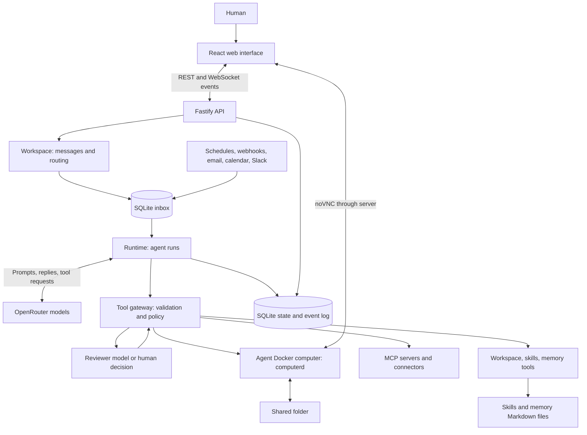
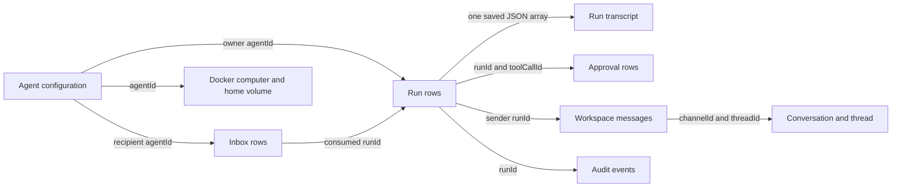
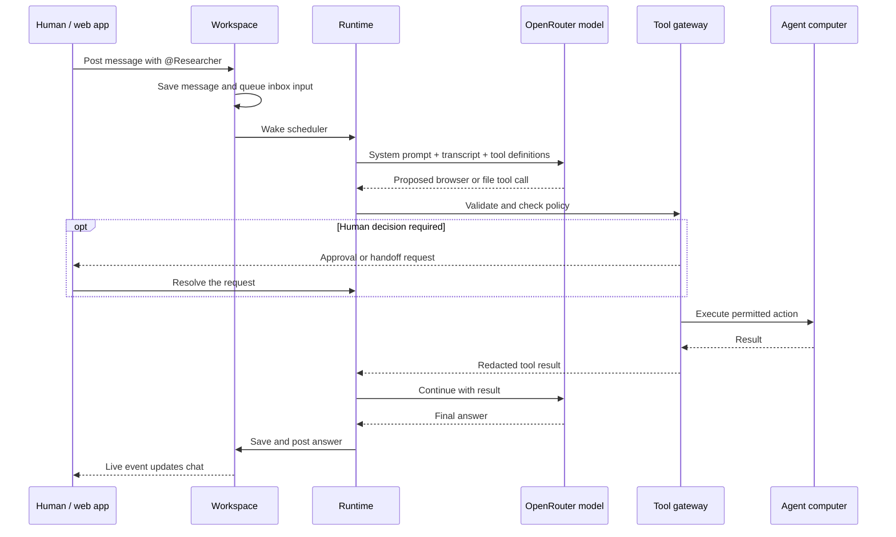
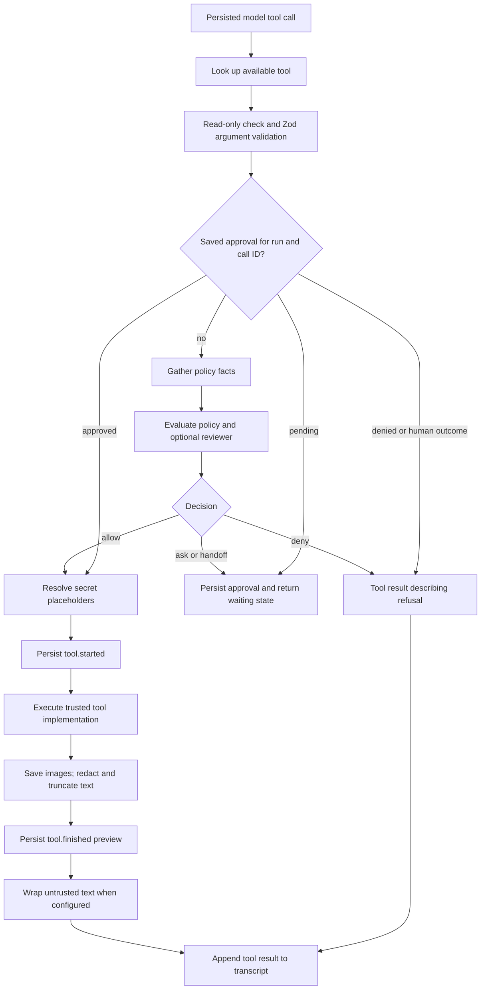
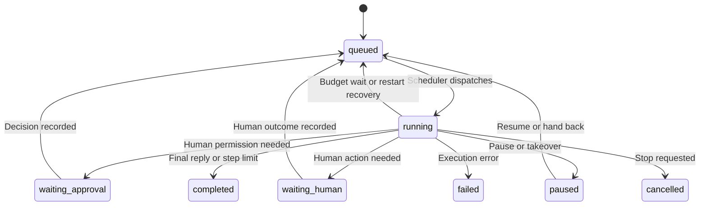

# TeamBot: project architecture and agent internals

**A technical guide to the application, with particular depth on agent execution, communication, context, tools, computers, memory, and recovery.**

Reviewed on **2 October 2026**, on branch **`grok-ui`**, against base commit **`6f3440f` and the existing working-tree edits**. This describes the checked-out source, rather than a running production installation. Environment-specific credentials, active agents, saved policies, and actual service availability were not inspected. Defaults below are code defaults; saved workspace settings can change behavior.

## Contents

1. [The application in plain English](#1-the-application-in-plain-english)
2. [The architecture](#2-the-architecture)
3. [The technology stack](#3-the-technology-stack)
4. [The main concepts and data model](#4-the-main-concepts-and-data-model)
5. [What happens when you give an agent work](#5-what-happens-when-you-give-an-agent-work)
6. [How agents communicate](#6-how-agents-communicate)
7. [Independent work, specialists, and agent creation](#7-independent-work-specialists-and-agent-creation)
8. [What a model sees and how context works](#8-what-a-model-sees-and-how-context-works)
9. [How tools are given to agents](#9-how-tools-are-given-to-agents)
10. [Tool reference](#10-tool-reference)
11. [Policy, review, and human approval](#11-policy-review-and-human-approval)
12. [The agent computer](#12-the-agent-computer)
13. [Browser and desktop control](#13-browser-and-desktop-control)
14. [Watching, takeover, setup, sleep, and snapshots](#14-watching-takeover-setup-sleep-and-snapshots)
15. [Skills](#15-skills)
16. [Memory, history, and shared files](#16-memory-history-and-shared-files)
17. [Secrets and credentials](#17-secrets-and-credentials)
18. [MCP and app connectors](#18-mcp-and-app-connectors)
19. [Coding agents](#19-coding-agents)
20. [Routines and event triggers](#20-routines-and-event-triggers)
21. [Telegram and Slack](#21-telegram-and-slack)
22. [People, permissions, and privacy](#22-people-permissions-and-privacy)
23. [Persistence, recovery, and audit](#23-persistence-recovery-and-audit)
24. [Budgets and execution limits](#24-budgets-and-execution-limits)
25. [The web interface and live updates](#25-the-web-interface-and-live-updates)
26. [Configuration, local development, and deployment](#26-configuration-local-development-and-deployment)
27. [Testing and troubleshooting](#27-testing-and-troubleshooting)
28. [What is implemented and what is planned](#28-what-is-implemented-and-what-is-planned)
29. [Questions you should be able to answer](#29-questions-you-should-be-able-to-answer)
30. [Source map and maintenance](#30-source-map-and-maintenance)

For an implementation-focused reading, start with [the runtime data contracts](#runtime-data-contracts), [scheduler mechanics](#scheduler-mechanics), [the exact agent loop](#the-exact-agent-loop), [message routing](#routing-algorithm-and-message-provenance), [a specialist exchange](#a-specialist-exchange-with-concrete-run-boundaries), [the model wire format](#transcript-and-model-wire-format), [the tool execution contract](#the-tool-execution-contract), and [persistence boundaries](#persistence-boundaries-and-crash-windows). Examples use symbolic IDs for readability; they are explanatory examples, not captured production records. Reduced interfaces omit unrelated fields; pseudocode explains control flow rather than replacing the source.

## 1. The application in plain English

TeamBot is a self-hosted chat workspace where humans work with a team of named AI agents. An agent has a role, instructions, a selected language model, lasting notes, selected skills and integrations, spending limits, and its own Linux computer.

You give agents work through conversation. They can research websites, run commands, create files, use connected applications, ask a specialist teammate for help, and request human approval or computer takeover. You follow their progress in the chat and can inspect their work log or watch their computer.

The central distinction is between **thinking** and **acting**. A language model proposes the next answer or tool call. TeamBot decides whether the proposed action is available and permitted, executes it, saves the outcome, and returns the result to the model.

An agent is therefore a combination of configuration, persisted work, a model, and an execution environment. It is not a separate model trained for that individual, and it does not need a permanently running process of its own. The server schedules work for it when input arrives.

**Self-hosted describes the workspace and computers.** Normal model calls still leave the machine through OpenRouter. Connected services, Telegram, Slack, and coding CLIs may also use external systems. Local storage does not make all processing local.

There is currently no task board. The unit of work is a **run**, shown through conversation and an optional progress checklist. Work starts from a human message, a teammate's routed message, a routine, or a system notification; there is no sweep that makes agents adopt abandoned tasks.

**A short explanation you can use:** “TeamBot is a self-hosted office for AI teammates. Each teammate has its own model and isolated computer. People assign work through chats, agents collaborate through messages and shared files, and a central server applies policy, approvals, budgets, and an audit trail to their actions.”

Sources: [README](../README.md), [domain types](../packages/shared/src/index.ts), [runtime](../apps/server/src/runtime/runtime.ts), [system prompt](../apps/server/src/runtime/prompt.ts).

## 2. The architecture

The application has four main parts: the web interface, the TeamBot server, the shared TypeScript definitions, and the agent computer image. OpenRouter and integrations sit outside those parts.



### The server is the coordinator

`createApp()` in `app.ts` constructs services and shares them through one application object. They are modules inside the same server process, not separately deployed microservices.

| Service | Responsibility |
|---|---|
| `workspace` | People, channels, DMs, messages, routing, conversation visibility |
| `runtime` | Scheduling, model/tool loop, pause, cancel, approval resume, recovery |
| `store` | SQLite queries, transactions, migrations, persisted state |
| `bus` | Save an event, then notify subscribers |
| `models` | Call OpenRouter, or an echo/scripted provider for offline use and tests |
| `tools` | Build each agent's available tool list |
| `policy` | Decide allow, review, ask, handoff, or deny |
| `vault` | Encrypt credentials, resolve placeholders, redact text |
| `computers` and `lifecycle` | Docker computers, network setup, setup scripts, idle sleep |
| `skills` and `memory` | Read and write reusable procedures and lasting notes |
| `mcp` | Connect to MCP servers and expose their tools |
| `cron` and `triggers` | Turn routines and external events into inbox input |
| `telegram` and `slack` | Bridge messages and human decisions |
| `auth` | Personal/team mode, passwords, sessions, invitations |
| `egress` and `snapshots` | Restricted internet access and home-folder archives |
| `telemetry` | Optional export of events and run traces |

The server starts these services, listens for HTTP requests, and shuts them down together. Tests replace outside dependencies with fakes through `AppOverrides`.

Sources: [composition root](../apps/server/src/app.ts), [startup](../apps/server/src/index.ts).

## 3. The technology stack

The project is a **TypeScript pnpm monorepo**. Dependency versions below describe manifest declarations in this checkout, not claims about the latest public releases. The lockfile determines installed versions for workspace dependencies.

| Area | What we use | Why it is here |
|---|---|---|
| Runtime | Node.js 22.13 or newer; pnpm 10, declared as `10.30.2` | Run server, manage workspace packages; Node supplies SQLite |
| Language | TypeScript, declared `6.0.3` | Shared strict types across server, web, and computer API |
| Server | Fastify 5; `tsx` | HTTP API and direct execution of server TypeScript |
| Real-time delivery | `@fastify/websocket` | Events to the web app and VNC transport |
| Production web serving | `@fastify/static` | Serve the built React app from the API server |
| Persistence | Built-in `node:sqlite` | Local database without a separate database service |
| Validation | Zod 4 | API/tool argument validation and JSON Schema generation |
| Policy | YAML and `@marcbachmann/cel-js` | Editable rules and optional conditional expressions |
| Models | OpenRouter, called with native `fetch` | One provider adapter for multiple tool-capable models |
| Integrations | `@modelcontextprotocol/sdk` | MCP clients, transports, and connector OAuth |
| Scheduling | Croner | Cron expression validation and recurring jobs |
| Email/calendar | ImapFlow, Mailparser, `ical.js` | Read IMAP messages and parse iCalendar events |
| Docker management | Dockerode | Create, inspect, stop, reset, and archive agent computers |
| Frontend | React 19, Vite 8 | Component UI and web development/build tooling |
| UI state/routing | Zustand 5, Wouter | Browser state and client navigation |
| Content and appearance | React Markdown, remark-gfm, Lucide, bundled Inter | Markdown, tables, icons, typography |
| Live desktop | noVNC in web; x11vnc in computer | Watch and interact with the agent's display |
| Browser automation | `playwright-core`, pinned `1.63.0` in computerd | Control the visible Chromium browser over CDP |
| Computer OS/display | Debian Bookworm, Xvfb, Fluxbox, Supervisor | Linux environment, virtual screen, window manager, service supervision |
| Desktop input | xdotool and scrot | Mouse/keyboard actions and screenshots |
| Testing | Vitest 5 | Deterministic server and integration tests |
| Observability | Custom OTLP/HTTP JSON export | Logs/traces without an OpenTelemetry SDK dependency |

The current implementation does not use a vector database, Redis queue, PostgreSQL, or a separate multi-agent orchestration framework. Coordination is written in this repository.

`packages/shared` is consumed directly as TypeScript; it does not need a separate compilation step. `pnpm build` builds the web app. The server continues to run through `tsx`; computerd is compiled when its Docker image is built.

Sources: [root package](../package.json), [server dependencies](../apps/server/package.json), [web dependencies](../apps/web/package.json), [computerd dependencies](../computer/computerd/package.json), [workspace](../pnpm-workspace.yaml).

## 4. The main concepts and data model

| Concept | Meaning | Where it lives |
|---|---|---|
| Human | Named person with owner/member role | SQLite |
| Agent | Named AI teammate and its capabilities/settings | SQLite |
| Channel | Group conversation, topic, members, optional lead | SQLite |
| DM | Conversation with fixed members | SQLite |
| Message | Text, author, mentions, attachments, optional thread/run association | SQLite |
| Thread | Replies linked to a root message | SQLite message relationships |
| Inbox item | Input waiting for one agent | SQLite |
| Run | One conversation-scoped execution, including status, costs, and checklist | SQLite |
| Transcript | User, assistant, and tool messages for a run | JSON stored in SQLite |
| Approval | A particular tool call awaiting or recording a human decision | SQLite |
| Routine | Prompt with cron or event trigger; called `Schedule` in types | SQLite |
| Event | Timestamped audit record with actor/agent/run/channel scope | SQLite |
| Skill | Reusable instructions and optional supporting files | Files under `data/skills` |
| Memory | Curated team notes or an agent's own notes | Files under `data/memory` |
| Attachment | Reference to an existing shared file | Message metadata plus file on disk |
| Snapshot | Archive and metadata for an agent's home directory | Files under `data/snapshots` |

An agent's important fields include its name, role, standing instructions, OpenRouter model ID, allowed skills, allowed MCP servers, budget, paused state, takeover person, setup script, optional image, desktop permission, and network rules. Avatar and color identify it in the UI.

Names are used for `@mentions`, so agents and people share a naming namespace. Agent IDs identify persistent records and Docker resources; names can change, with corresponding agent-memory file renaming.

### Runtime data contracts

The minimum useful distinction is **Agent = configuration**, **InboxItem = input delivery**, **Run = execution state**, and **TranscriptMessage = model conversation**. The container is a separate resource associated with the agent ID. A run does not create a new permanent agent or a new isolated computer each time.

The following reduced contracts show the fields that control execution:

```typescript
type Initiator = 'human' | 'agent' | 'schedule' | 'event';

interface InboxItem {
  id: string;
  agentId: string;             // recipient
  kind: 'message' | 'schedule' | 'system' | 'task';
  text: string;                // formatted input, not a pointer to a model session
  channelId: string | null;
  threadId: string | null;
  depth: number;
  initiator: Initiator;
  readOnly: boolean;
  runId: string | null;        // null until consumed by a run
}

interface Run {
  id: string;
  agentId: string;
  status: RunStatus;
  channelId: string | null;    // destination for automatic answers
  threadId: string | null;
  initiator: Initiator;
  readOnly: boolean;
  depth: number;
  steps: number;              // completed main-agent model responses
  tokensIn: number;
  tokensOut: number;
  costUsd: number;
  progress: ProgressStep[];    // model-maintained checklist
}
```

`InboxItem.runId` is a consumption marker. The store retains consumed inbox rows; it does not pop and delete them from a queue. Pending input is selected using `run_id IS NULL`, ordered by `created_at, rowid`. The typed inbox contract has no `sourceMessageId`, `parentRunId`, or specialist-result handle. Message input contains a formatted copy of the sender's text and shared-file references.

The logical relationships are:



This is a logical ownership diagram, not a claim that every arrow is enforced by a SQL foreign-key constraint. SQLite stores normalized channel membership alongside JSON columns for transcripts, budgets, selections, message metadata, progress, and event payloads. `setTranscript()` rewrites the run's complete JSON message array. This is not one SQL row per model message or an event-sourced replay of the whole transcript.

`Agent.status` is a derived display summary. For example, a queued run can make an agent look `working` before its next model call, while a saved waiting run produces `waiting`. The scheduler relies on run status, pause/takeover flags, and its in-memory active map, rather than treating the agent's status label as its sole lock.

Sources: [shared types](../packages/shared/src/index.ts), [store and migrations](../apps/server/src/store.ts), [model message types](../apps/server/src/models/types.ts).

## 5. What happens when you give an agent work

Suppose you send `@Researcher compare three tools and save your findings in /shared/comparison.md` in a group chat.

1. **The web app posts your message.** The server identifies the acting human, checks conversation visibility, validates text and attachments, and saves the message.
2. **Routing selects the agent.** `Workspace.route()` resolves the mention and creates an inbox item for Researcher. This item records the conversation, optional thread, depth, initiator, and read-only flag.
3. **The runtime schedules a run.** It checks pauses, takeover, existing work, budget, and global concurrency. It permits one active run per agent.
4. **Input becomes model context.** The inbox text and a small amount of recent conversation are put into a durable transcript. Consuming inbox items and saving that input happen in one transaction.
5. **The prompt and tool list are rebuilt.** Current instructions, roster, skills, memory, and secret names accompany the transcript. The model receives tool schemas appropriate to the agent and run.
6. **The model responds.** It either proposes tool calls or provides a final answer. The response is saved, and tokens/cost are recorded.
7. **Each proposed tool call passes the gateway.** TeamBot checks arguments and policy, may request review or human input, then executes permitted calls. Multiple calls from one response are executed one at a time within that run.
8. **Results return to the model.** Text is redacted, limited, and tagged as untrusted where appropriate. Screenshots can be saved and sent as image inputs. The loop continues.
9. **The agent finishes.** A final answer without tool calls is posted automatically in the run's conversation and thread. Exactly `[silent]` suppresses the chat reply.



New input for the **same channel, thread, and read-only state** can enter the run while it is working. Input from a different conversation waits for another run. This keeps a private DM's response from accidentally being posted in a group chat by the scheduling mechanism.

### Scheduler mechanics

`Runtime` has an in-memory `Map<runId, ActiveRun>`. An entry contains the agent ID, an `AbortController`, a completion promise, and an optional stop reason. It is added before asynchronous execution begins and removed in the launch cleanup. The map represents executing work in this process; the database represents durable work.

`start()` recovers interrupted runs, installs a three-second polling timer, and immediately calls `poke()`. Message routing, human decisions, and run completion also poke the scheduler. A `dispatching`/`again` guard prevents recursive dispatch from re-entering the scheduler while it is already selecting work. This matters because routing and event handling can synchronously trigger more work.

The selection algorithm is approximately:

```text
if the workspace is paused: return
for each agent, in creation order:
    if the global executing-run limit is reached: return
    if paused, under human takeover, or already executing: skip
    find the newest run in ACTIVE_RUN_STATUSES
    if such a run exists:
        launch it only if queued/running and budget permits
        skip creating any other run for this agent
    otherwise:
        find the oldest ready unconsumed inbox item
        if input exists and budget permits:
            create a queued run for its conversation/thread/readOnly state
            create its empty transcript
            launch it
```

The scheduler serializes **all conversations for an agent**, not just one channel. A run waiting for approval releases its global executing slot but remains an active saved run. That agent cannot start answering a separate DM while it waits. Other agents can use the freed slot. The default global limit is four executing runs.

There is no Redis worker queue, SQL lease with expiry, or distributed lock in this path. Agent iteration is creation-ordered rather than a fairness-enforcing round-robin queue. The intended coordination model is one runtime in one server process. Starting multiple independent server runtimes against the same database would need additional work-claim coordination; SQLite write serialization alone does not provide that scheduling contract.

### The exact agent loop

The order inside `Runtime.loop()` determines both responsiveness and safety:

1. Check the abort signal and reload the run, agent, and saved transcript.
2. Find uncompleted tool calls from the latest assistant message. Execute only the first pending call. Save its tool result and loop again. If it needs a human decision, return a waiting status immediately.
3. Only after that tool batch is drained, collect ready inbox items that belong to this run. Append a single combined `user` message. If this is the run's first input, it includes a message, and the agent's previous run in the same conversation was cut short by the step limit, the run starts from that run's transcript and checklist instead of an empty one. In one synchronous SQLite transaction, mark those inputs consumed, save the transcript, and update depth/initiator.
4. If there is no input or the last message is an assistant answer without tool calls, finish.
5. If the step limit is reached, post a non-routed stop note and finish.
6. Check budget, compact old context if necessary, rebuild the system prompt and eligible tool schemas, and make one model call.
7. Normalize tool-call IDs, append and persist the assistant message, update usage and step counters, and append `llm.response` to the audit log.
8. If this assistant message has no tool calls, post its nonempty answer unless it is exactly `[silent]`. Go back to the top; new matching input can still arrive before the completion check.

`pendingToolCalls()` scans backward to the latest assistant message. It compares that message's call IDs with subsequent `tool` messages' `tool_call_id` values. A call is pending when there is no corresponding tool result. A response containing three tool calls therefore creates three serial gateway executions, followed by another model call. Different agents may execute concurrently, but calls within this run do not execute as a parallel batch.

Pending tool calls have priority over new inbox messages. A human correction that arrives during a batch is consumed after the batch completes; posting a correction alone does not cancel the current action. Pause or cancellation uses the abort path. This distinction matters when explaining how quickly a changed instruction affects an already proposed action.

Conversation matching is:

```text
item.readOnly must equal run.readOnly
system input with no channel may enter whichever matching-mode run is next
otherwise:
    effective channel must equal run.channelId
    effective thread must equal run.threadId
```

Channel-less ordinary input defaults to the owner's DM with that agent and a null thread. Incoming human-origin input sets the run's initiator to `human`; depth becomes the maximum of applicable input depths and the existing depth. Read-only state is not promoted to writable when messages merge: differently flagged input waits for another run.

An ordinary tool exception is usually converted into an `Error: ...` tool result, allowing the model to inspect it and choose a new plan. An uncaught runtime/model failure marks the run failed. Finishing is based on transcript shape, not a separate evaluator that proves the user's goal is satisfied. `finishReason` exists in the provider response type, but the loop's completion test uses the assistant message and its tool-call list.

Sources: [message routing](../apps/server/src/workspace.ts), [agent loop, dispatch, and controls](../apps/server/src/runtime/runtime.ts), [prompt construction](../apps/server/src/runtime/prompt.ts), [store transactions](../apps/server/src/store.ts).

## 6. How agents communicate

Agents communicate through TeamBot's message tools. They do not share a live thought process or call one another's model directly.

### Channels and mentions

`post_message` sends a channel message. Mentioning `@Name` routes work to that named agent. Merely belonging to a channel does not make every agent answer every message. A human message with no routed target can go to the channel's configured lead agent.

Human replies in a group-chat thread also wake agents who have participated in that thread, without requiring another mention. The automatic final reply stays in that thread. Cross-conversation thread references are rejected.

### Direct messages

`send_dm` messages a person: it resolves the teammate, gets or creates the DM, saves the message and routes it. Sending to yourself is rejected, and so is sending to an agent: agents hand each other work with `ask_agent` (below).

A person's DM with an agent belongs to that agent. If you mention Writer inside your DM with Lead, the mention does **not** directly wake Writer in your private DM. Lead can decide to send Writer its own focused request. In a DM between people, mentions can bring an agent into the conversation's work without changing the DM's members.

### Asking a teammate agent: `ask_agent`

`ask_agent` takes the teammate's name, the `task`, optional `context` and `constraints`, the `expected_result` (what a good answer looks like) and attachments. The request is posted in the two agents' DM as a structured message (Task, Context, Constraints, A good answer), where people can read it, and recorded as a **handoff** (`runtime/handoffs.ts`, table `handoffs`). The tool returns a receipt; the asked agent works in its own run.

The asked agent is told that its final reply is its answer. That reply is still posted in the agents' DM, but instead of waking the asker there, it goes back to the **conversation the asking run worked in** (the person's chat, or the group chat and thread). All of one run's answers arrive together, in one inbox item, once none of them is still open; an answer that comes while the asking run is still working is folded into that run. If the asking run is itself working for another agent, it ends with `[silent]` after asking and answers its own asker once it hears back.

Once its reply has answered a request, the asked agent gets one more turn (`headsUpRequest` in `runtime.ts`) to write a one- or two-line note for the person the request was for, posted in its own chat with them: who asked what, and what went back. That person is the one in the DM the request was asked from, followed back through agents that asked on someone's behalf (`Handoffs.headsUp`). A request from a group chat gets no note, and neither does one whose agent has more work waiting for that conversation, has hit the step limit or is over budget. An empty or `[silent]` note is dropped.

A request that ends without an answer is said out loud, the same way: the asked agent's run failed, a person stopped it, it finished without replying (or hit the step limit), or the agent was removed. The asker is told who didn't answer and why, and to do that part itself or say plainly that it didn't come back. If the asked agent runs out of budget mid-answer, the asker is told once and the handoff stays open. If the asking run is stopped or fails, its open requests are cancelled and a late answer wakes nobody.

`ask_agent` refuses: asking yourself or a person; asking an agent that is waiting on your answer (say it in your reply instead); a paused or over-budget agent; a job already passed between agents `TEAMBOT_MAX_AGENT_DEPTH` times; and a run that has already handed work to `TEAMBOT_MAX_HANDOFFS_PER_RUN` teammates (default 4), counting agents it @mentioned in group chats. `post_message` applies the same limit to new agent mentions and refuses a DM with another agent.

Example: Lead asks Researcher to check a source, with the question, relevant context, constraints and the expected output. Researcher checks it on its own computer and replies. Lead gets the answer in the person's chat, where it was asked, and replies there. Each step remains independently governed and logged.

### Preventing endless conversations

Messages carry an agent-hop depth. Human messages start at depth zero. Agent messages increase it, and routing drops work beyond `TEAMBOT_MAX_AGENT_DEPTH`, which defaults to six. Dropped routing emits `loop.guard`.

Prompts also discourage unnecessary acknowledgements and repeated handoffs. The limit is a routing guard, not proof that every collaboration will reach a useful conclusion.

The UI can show “Messaged …” inside the initiating conversation and link to the agents' conversation. That visual association comes from the outgoing message's `runId`. The answer's return trip comes from the handoff record: it keeps the answering message (`answer_id`, migration 18), so the initiating conversation also shows “Message from …” where the answer came in (`listSentElsewhere`, and live from the `handoff.answered` event, which carries the message). The asked agent's note to the person shows in their chat under “Asked by …”, because the note's run worked in the agents' DM. The asking run's full log shows “… answered” or “No answer from …” when it settles.

### Routing algorithm and message provenance

`Workspace.postMessage()` is the shared entry point for human and agent messages. It validates the channel and attachments, trims text, limits text to 20,000 characters and attachments to 20, and checks that a thread root belongs to this channel. Replying to a reply is normalized to the original thread root. It saves the message, emits `message.created`, and normally invokes `route()`.

Mention parsing uses a regular expression, not a Markdown parser:

```text
/(^|[^\w@])@([A-Za-z][A-Za-z0-9_-]{0,31})/g
```

Names are lowercased, deduplicated, and resolved against known members. This means a valid-looking mention inside copied text or a code example can still be considered a mention. It is not restricted to visible prose outside code fences.

The recipient selection rules are:

| Situation | Target selection |
|---|---|
| Group message with agent mentions | Mentioned agents |
| Human group-thread reply | Also add agents that authored the root or retrieved replies in that thread |
| Human group message with no selected agent | Configured lead agent, if valid |
| DM containing agent members | Replace mention targets with the DM's agent members |
| DM with only human members | Agent mentions can select agents without changing the DM member list |
| Any message authored by an agent | Remove that agent from its own target set |

Thread participant discovery uses the stored thread listing, whose default limit is 200 replies. It is not an unlimited scan of every historical participant. Group routing may add a selected agent to channel membership; DM routing does not turn the fixed DM into a group conversation.

The sending actor carries `{ id, depth, initiator, runId? }`. Human messages reset depth to zero. Agent messages use `actor.depth + 1`. The initiator records the originating cause of the work, not merely the immediate sender's member kind: a human-triggered agent run can send a teammate message whose initiator remains `human`. Policy can match on this propagated origin.

For each selected agent, routing copies formatted message text into a new inbox row with channel/thread/depth/initiator/read-only metadata. When depth is **greater than** the configured limit it logs `loop.guard` and skips that delivery. With the default limit, depth six is accepted and seven is dropped. Explicit message tools propagate the source run's read-only state through this path.

`Message.runId` identifies the **sending run**. The new recipient run gets its own ID later. This is useful for showing outgoing specialist messages in the sender's work log, but it is not a parent-child run relationship. The link between a request and its answer is the `handoffs` row: the asking run, the agents' DM, the origin conversation and thread, and how it ended.

### A specialist exchange with concrete run boundaries

Consider a human DM with Lead (`dm-human-lead`) and a separate Lead–Researcher DM (`dm-lead-researcher`). The symbolic records below show what actually happens:

| Step | Persisted change | Execution consequence |
|---|---|---|
| 1. Human asks Lead | Input for Lead, depth 0, channel `dm-human-lead` | Scheduler creates `run-L1` |
| 2. Lead calls `ask_agent` for Researcher | Structured request with `runId=run-L1`, depth 1, in `dm-lead-researcher`; inbox input for Researcher; an open handoff from `run-L1` whose origin is `dm-human-lead` | Tool returns a receipt; Lead's model can continue, or end its turn with a one-line note |
| 3. Researcher starts | New `run-R1`, depth 1, channel `dm-lead-researcher` | Researcher's prompt, tools, model and computer are used; it is told its final reply is its answer |
| 4. Researcher answers automatically | Message with `runId=run-R1`, depth 2, in `dm-lead-researcher`; the handoff is settled as answered | Routing does not wake Lead in the agents' DM |
| 5. The answer goes back | Once `run-L1` has no open handoffs, one inbox input for Lead in `dm-human-lead`, depth 2 | Folded into `run-L1` if it is still working, otherwise a new `run-L2` in the human's DM |
| 6. Lead replies | Lead's automatic final reply | Posted in the human's DM, where the question was asked |

The transcript for Lead's request contains this sort of tool exchange:

```json
[
  {
    "role": "assistant",
    "content": null,
    "tool_calls": [{
      "id": "call-research",
      "type": "function",
      "function": {
        "name": "ask_agent",
        "arguments": "{\"to\":\"Researcher\",\"task\":\"Verify the source\",\"context\":\"The draft is /shared/draft.md\",\"expected_result\":\"Whether the source supports the claim, with a link\"}"
      }
    }]
  },
  {
    "role": "tool",
    "tool_call_id": "call-research",
    "content": "Asked Researcher. Their answer comes back to you in this conversation, together with any other answers you are waiting for. ..."
  }
]
```

The receipt does not contain Researcher's answer; Lead and Researcher progress concurrently subject to the global limit. If Lead is waiting for a human decision on `run-L1` when the answer arrives, the answer waits in Lead's inbox until that run is released.

`post_message` accepts `channel`, `text` and optional attachments and does not expose a `threadId` argument. Automatic final answers preserve their run's originating thread, while explicit channel posts are top-level messages. An `ask_agent` answer returns to the asking run's thread.

An agent's reply in an agent-to-agent DM that answers no open request still routes back to the other agent, as before. `[silent]` suppresses only the automatic final chat message; it does not retract messages already sent by tools.

Shared files provide an output convention, not a locking protocol. If multiple specialists write the same file, TeamBot does not merge their contributions or enforce ownership. Distinct output paths and explicit request text are conventions the agents must follow.

Sources: [workspace routing and visibility](../apps/server/src/workspace.ts), [message tools](../apps/server/src/tools/workspace-tools.ts), [run grouping](../apps/server/src/runtime/runtime.ts), [sent-elsewhere query](../apps/server/src/store.ts), [web state](../apps/web/src/store.ts).

## 7. Independent work, specialists, and agent creation

The current source tells agents to do research, reasoning, and execution independently by default. They should ask an existing agent only when that agent's stated role shows a relevant specialty. Arbitrarily dividing routine work across agents is discouraged through prompt/tool descriptions.

This is a **behavioral instruction**, rather than a server-side semantic classifier that decides whether a specialty truly fits. The message tools remain available, and policy can constrain them further.

### Permanent teammates

`create_agent` lets an agent propose a permanent teammate for an ongoing specialty. The default policy requires human approval. It validates names, creator limits, requested skills, and requested MCP permissions before asking, and checks again at execution.

### Routines agents set up

When a person asks for something to happen regularly, an agent sets up a time-based routine with `create_routine` (`tools/routine-tools.ts`), for itself or a teammate: a name, a 5-field cron in UTC and the prompt the agent gets each time. It reports in the group chat it was set up from, or, from a DM, in the DM between that person and the agent that runs it. The default policy has a reviewer check it (risk `external`, so a workspace with its own saved policy asks a person). It is refused, before anyone reviews it, when it would run more often than every 15 minutes (`MIN_ROUTINE_MINUTES`), when its agent already has 10 routines, or when the run asking is itself a routine's. `list_routines` shows routines the run may read about. `stop_routine` stops one the agent runs or set up: with `pause: true` it is paused, to bring back with `resume_routine`; otherwise a routine an agent set up is removed, and one a person made is only paused, so the person can resume or delete it. A routine's own run can't resume routines. Webhook, email, Slack and calendar routines still need a person, in the routine editor.

The new agent:

- Gets a role, standing instructions, and model; omitted model uses the workspace default.
- Inherits its creator's network rules and budget **limits**.
- Can request only skills and MCP servers available to its creator. Omitted skills inherit the creator's selection; omitted MCP servers default to none.
- Starts without desktop control, a setup script, or a custom image.
- Joins `#general` if it exists, and the creating run's group channel if applicable.
- Is not inserted into the creator's private DM and is not automatically given a job merely by being created.

A creator can have at most five agents it created still on the team. Removing one frees a slot. This is a per-creator limit, not a global maximum number of agents. New permanent agents have their own budget accounting; inheriting the numeric caps does not create one shared spending pool with the creator.

### No temporary helpers

TeamBot does not spawn temporary helper bots or sub-agents. There is no `spawn_helpers` tool, agents have no parent, and migration 16 removed any helpers left from earlier versions (their past runs and events stay as history). Do not explain TeamBot as spawning parallel temporary bots.

Sources: [system prompt](../apps/server/src/runtime/prompt.ts), [agent creation](../apps/server/src/tools/agent-tools.ts), [agents joining and leaving](../apps/server/src/runtime/agents.ts), [agent tests](../apps/server/test/create-agent.test.ts).

## 8. What a model sees and how context works

Before every model call, TeamBot rebuilds a system prompt containing:

- The agent's identity, role, and standing instructions.
- The human and permanent-agent roster, roles, and agent statuses.
- Group-channel names and membership hints.
- Operating instructions for messages, files, progress, approvals, secrets, and untrusted content.
- Descriptions of the skills this agent may load.
- Team memory and that agent's own memory.
- Names of usable stored secrets, with placeholder instructions rather than values.
- Relevant read-only, desktop, or coding-agent instructions.
- The current time in UTC.

The model also receives the current run's transcript and the available function schemas. It does not receive the entire database, all files, all skills' full instructions, or all previous conversations automatically.

At a run's start, a normal channel message can include up to nine recent top-level messages as context. A thread includes the root and up to eight earlier replies. Individual history entries are clipped to 1,500 characters. Agents can use `read_channel` or `search_history` for more accessible history.

Normal model calls use OpenRouter's `/chat/completions` endpoint, `tool_choice: auto`, and a default maximum output of 8,192 tokens. The provider retries transient/network failures up to four attempts. The model picker lists tool-capable models and includes reported context length, modalities, and prices.

### Long runs and compaction

When the transcript's estimated size reaches `TEAMBOT_COMPACT_AT_TOKENS` (default 60,000), a utility model summarizes older steps. Recent messages remain verbatim, and the cut avoids separating tool calls from their results. Token estimation uses serialized character length, not the model's exact tokenizer.

If summarization fails, older content is dropped with an explicit note. Compaction therefore makes long runs manageable but can lose detail. It changes the run transcript; it is separate from lasting Markdown memory. Its cost is logged.

### Images

Desktop screenshots are saved under `data/screens/<runId>/`. The latest two image-bearing tool results are selected for model input, with older screenshots omitted to save context. A model must support image input to make useful visual decisions; desktop permission alone does not supply vision.

### Transcript and model wire format

The application owns the conversation history. It sends a complete constructed request for each step; it does not use a provider-side persistent agent session as its source of truth. The saved transcript has three message forms:

```typescript
type TranscriptMessage =
  | { role: 'user'; content: string }
  | {
      role: 'assistant';
      content: string | null;
      tool_calls?: ToolCall[];
      reasoning_details?: unknown;
    }
  | {
      role: 'tool';
      tool_call_id: string;
      content: string;
      images?: string[];       // local screenshot paths
    };

interface ToolCall {
  id: string;
  type: 'function';
  function: { name: string; arguments: string };
}
```

Tool arguments are a **JSON string inside a JSON response**, not already trusted TypeScript values. The gateway parses and validates them later. Tool results use the exact call ID so the provider and runtime can associate a result with the proposed action. The adapter generates missing IDs; the runtime adjusts reused IDs to remain unique within a run because approvals and recovery also rely on them.

`reasoning_details`, when supplied by the provider, is retained on the assistant message and forwarded on later calls. This is a provider compatibility field. It does not give another teammate access to this run's private reasoning or transcript. Historical detail can be lost when the corresponding messages are compacted.

The conceptual request construction is:

```text
messages = [fresh system prompt] + toModelMessages(saved transcript)
tools = registry.specs(eligible agent tools filtered for this run)
model = agent.model
max_tokens = 8192 unless this caller overrides it
tool_choice = auto when tools are present
usage.include = true
```

`formatInbox()` turns several matching inbox deliveries into one `user` message with numbered entries. On the first input only, it adds recent conversation context. For a thread, that is the root plus up to eight replies before the first input's timestamp; otherwise it is up to nine preceding top-level messages. A text-suffix check attempts to avoid duplicating messages already represented by current input. This is a bounded textual context builder, not a general retrieval planner.

The system prompt is **not stored in `run_transcripts`**. Each step reads current agent settings, the roster, selected skill summaries, secret names, and memory. Changes can therefore affect a run's next model call, but the transcript alone does not reproduce the exact historical prompt. The model call already in flight continues with its previously constructed request.

Besides that context, the prompt carries working rules: how to talk to people and teammates, when to plan with a checklist, how to treat untrusted content, to say where an answer came from (naming what was read, and marking facts people act on as unverified when nothing reachable confirms them, without going hunting for a source), and to report only actions a tool result in the job shows happened. These are instructions to the model, not checks: the runtime does not compare a reply's claims against the tool results.

Resuming a paused or approved run uses its saved transcript. A message arriving after a run has completed normally starts a new run, with bounded recent chat context and current memory rather than the previous run's complete transcript. Saying “continue” in chat is therefore different from resuming the persisted paused execution. Findings needed beyond one run should be placed in an appropriate artifact or communicated clearly in the conversation.

The OpenRouter adapter is a non-streaming `fetch` request with a five-minute timeout per attempt. It allows four attempts total for network errors and selected HTTP statuses, using approximately one-, three-, and nine-second backoffs. A retry is a repeated model request, not a replay of the model's proposed computer actions: actions are executed only after a response reaches the runtime. Provider-side billing after a lost response is not reconstructed by TeamBot's saved usage fields.

### Compaction and image transformation details

The estimate is `ceil(JSON.stringify(transcript).length / 3.5)`. It excludes the freshly built system prompt, tool schemas, and image bytes inserted for the model. It is therefore a heuristic threshold, not proof that a request fits the selected model's context window.

The compactor keeps a tail targeting 35% of the configured threshold. It moves the cut forward past tool-result messages so retained results do not begin without their associated assistant call. Older messages are rendered for the utility model with clipping: user text 3,000 characters, assistant text 2,000, tool arguments 400, and tool-result text 1,500. The summary call permits up to 2,000 output tokens. The saved transcript becomes a `user` summary message followed by the retained tail.

Screenshots are stored as files, with paths in `ToolMessage.images`. `toModelMessages()` reads the selected files, creates image data URLs, and adds multimodal **user** content on the way to the provider. It flushes images after the associated consecutive tool-result messages so it does not insert user content between an assistant tool-call batch and its required results. The saved transcript does not contain those base64 image messages.

Selection retains the latest two **image-bearing tool results**; a result containing several images can contribute several images. Older image paths remain in the transcript/storage until other retention or compaction behavior removes references. The limit is context selection, not automatic deletion of the older screenshot files.

Sources: [prompt](../apps/server/src/runtime/prompt.ts), [model contracts](../apps/server/src/models/types.ts), [OpenRouter adapter](../apps/server/src/models/openrouter.ts), [compaction](../apps/server/src/runtime/compaction.ts), [vision](../apps/server/src/runtime/vision.ts).

## 9. How tools are given to agents

A tool is a server definition with a name, description, argument schema, risk classification, and execution function. It can also declare availability, policy facts, an approval/log summary, untrusted output, and read-only eligibility.

The **ToolRegistry** combines workspace, knowledge, agent-creation, computer, desktop, and coding tools, plus eligible MCP tools. `forAgent()` filters availability; the runtime filters again for read-only runs. Zod schemas become JSON Schema function definitions sent to the model.

The model only proposes a function name and JSON arguments. It does not receive a direct Docker connection or the computerd token. `handleCall()` finds the eligible tool again and validates the request before executing it.

Four different controls matter:

| Control | Question it answers |
|---|---|
| Agent configuration / `available()` | Is this capability offered to this agent? |
| Read-only eligibility | Is it permitted in this monitoring run? |
| Policy/review/approval | May this particular proposed action proceed? |
| Computer firewall/container and service permissions | What can the executing process actually reach? |

For example, enabling desktop control exposes desktop tools, assigning an MCP server exposes its connected tools, and storing a supported coding key makes the coding adapter available. None of these settings skips the policy gateway.

### The tool execution contract

The important server-side interfaces are approximately:

```typescript
interface ToolContext {
  app: App;
  agent: Agent;
  run: Run;
  signal: AbortSignal;
  computer(): Promise<ComputerHandle>;
}

interface ToolDef<A> {
  name: string;
  description: string;
  schema: z.ZodType<A>;
  parameters?: Record<string, unknown>; // external JSON Schema override
  risk: 'internal' | 'read' | 'write' | 'external';
  untrusted?: boolean;
  readOnlyOk?: boolean;
  available?(agent: Agent, app: App): boolean;
  facts?(args: A, ctx: ToolContext): Promise<PolicyFacts>;
  summarize?(args: A, facts: PolicyFacts): string;
  execute(args: A, ctx: ToolContext): Promise<string | ToolOutput>;
}
```

The registry constructs built-in definitions once from each tool module. `forAgent()` checks each built-in's availability and appends tools from assigned connected MCP servers. `specs()` converts definitions to OpenAI-compatible `{ type: 'function', function: { name, description, parameters } }` objects, caching by definition identity in a `WeakMap`. Zod supplies built-in JSON Schema; MCP definitions use the supplied `parameters` override.

Giving the model a schema is only the proposal layer. `handleCall()` calls `find()` against the current agent's available tools again. A tool removed after the model response can be rejected before execution. Read-only eligibility is also checked again; it is computed as `readOnlyOk ?? (risk === 'read')`, so internal tools need explicit permission to appear in a read-only run.

The tool executes with references to the app, current run and agent, abort signal, and a lazy `computer()` function. Workspace and memory tools can finish without starting Docker. A browser or shell tool obtains a ready computer through lifecycle management. Tool implementations are trusted server code with access to these services; tool isolation comes from where they execute, not from `ToolDef` acting as a JavaScript sandbox.

The normal execution pipeline is:



Some fact inspection obtains the computer first, so container startup, network configuration, or setup can occur **before** the tool's policy decision. Gathering a button label is separate from clicking it, but it is not a guarantee that no lifecycle activity has occurred before approval. Forced approval/takeover tools use their own decision path without ordinary action-fact inspection.

Results are redacted and truncated to 16,000 characters before the untrusted wrapper is added. `tool.finished` stores the first 800 characters as a recovery/audit preview, plus timing and success state. A tool's returned `Error:` text can be observed by the model and used to replan; `tool.finished.ok=false` does not automatically fail the whole run.

Where `untrusted` is set, the gateway places text in `<untrusted_content>` tags and escapes lookalike delimiters in the source text. The prompt tells the model to treat it as information. This is a prompt defense, not an executable information-flow type system. Binary screenshot content is conveyed through the image path/vision pipeline rather than being made safe by text tags.

Sources: [registry](../apps/server/src/tools/registry.ts), [tool contract](../apps/server/src/tools/types.ts), [gateway](../apps/server/src/runtime/runtime.ts), [untrusted wrapper](../apps/server/src/util.ts).

## 10. Tool reference

This is the built-in tool inventory in the reviewed source. “Risk” selects a default policy; matching rules can make the decision stricter or otherwise override that default.

| Tools | Purpose | Risk / availability |
|---|---|---|
| `post_message`, `send_dm`, `ask_agent` | Talk to the team; hand a teammate agent work and get its answer back; share attachments | Internal; allowed in read-only runs, with downstream read-only propagation |
| `read_channel` | Read accessible recent messages | Internal; read-only eligible |
| `update_progress` | Save the run's full checklist | Internal; read-only eligible |
| `ask_for_approval` | Explicitly pause for a human decision | Internal; forced approval flow |
| `request_human_takeover` | Ask a human to perform a computer step | Internal; forced takeover flow |
| `list_pages`, `read_page` | Find and read the team's pages (Markdown documents), with each page's revision | Read; `read_page` output is untrusted |
| `create_page`, `edit_page` | Write a page; edits name the revision they started from and are refused if it moved on | Write |
| `propose_page` | Show a person a draft page; saved only on **Approve & save** | Internal; forced approval flow |
| `show_ui` | Draw an interface the agent writes (HTML, CSS, script) in a sandboxed frame in the chat | Internal; read-only eligible; off with `TEAMBOT_GENERATIVE_UI=0` |
| `ui_<name>` | Draw a published component, with arguments checked against its JSON Schema | Internal; read-only eligible; one per published component |
| `draft_component` | Save a reusable component as a draft for a person to publish | Write |
| `use_skill` | Load instructions and copy eligible supporting files | Internal; read-only eligible |
| `remember`, `forget` | Add or remove lasting agent/team notes | Internal; excluded from read-only runs; team changes reviewed by default |
| `search_history` | Find accessible past messages | Internal; read-only eligible |
| `create_agent` | Propose a permanent specialist teammate | External; asks by default |
| `create_routine`, `list_routines`, `stop_routine`, `resume_routine` | Set up, see, pause, resume and stop time-based routines for itself or a teammate | `create_routine` external, reviewed by default; the others internal |
| `shell` | Run Bash on the agent computer | Write; default 120 seconds, declared maximum 900 |
| `read_file`, `list_files` | Read text or list computer files | Read |
| `write_file` | Create, overwrite, or append text | Write |
| `browser_navigate`, `browser_snapshot` | Open a URL or inspect the current page | Read |
| `browser_click`, `browser_type`, `browser_press` | Act on page elements or focus | Write |
| `browser_scroll`, `browser_back`, `browser_tabs` | Navigate/inspect browser state; list or switch tabs | Read |
| `computer_screenshot`, `computer_scroll` | Observe or scroll the desktop | Read; desktop must be enabled |
| `computer_click`, `computer_type`, `computer_key`, `computer_drag` | Mouse/keyboard desktop actions | Write; desktop must be enabled |
| `run_coding_agent` | Run Claude Code, Codex, or Gemini CLI on the computer | Write; requires a supported stored key; reviewed by default |
| `mcp__<server>__<tool>` | Call a selected integration | External; connected and assigned server required; asks by default |

Read-only selection is `readOnlyOk ?? risk === 'read'`. The word “internal” does not automatically mean read-only. Messages and checklists are explicit exceptions. `use_skill` may copy supporting files even in a read-only run, so read-only describes the offered work capabilities rather than an OS filesystem mounted read-only.

Page, file-content, shell, coding, and MCP results are marked untrusted where defined. A listing or an internal message is not handled identically to arbitrary outside text.

Sources: [workspace tools](../apps/server/src/tools/workspace-tools.ts), [page tools](../apps/server/src/tools/page-tools.ts), [UI tools](../apps/server/src/tools/ui-tools.ts) and [components](../apps/server/src/components.ts), [knowledge tools](../apps/server/src/tools/knowledge-tools.ts), [computer tools](../apps/server/src/tools/computer-tools.ts), [desktop tools](../apps/server/src/tools/desktop-tools.ts), [coding tools](../apps/server/src/tools/coding-tools.ts), [MCP](../apps/server/src/tools/mcp.ts).

## 11. Policy, review, and human approval

The gateway processes a call in this order:

1. Confirm the tool is available; enforce read-only eligibility.
2. Parse JSON and validate/default arguments.
3. Inspect action facts if required, such as page domain, button label, or input type.
4. Evaluate the policy, or use a forced approval/takeover flow.
5. If the decision is `review`, call the reviewer model.
6. Deny, pause for human input, or proceed.
7. Resolve secret placeholders immediately before execution.
8. Record the start, execute, redact/limit results, record completion, and return the result.

| Decision | Result |
|---|---|
| `allow` | Execute the call |
| `review` | Independent reviewer call returns allow, ask, or deny |
| `ask` | Save an approval and wait for a human to approve or deny |
| `handoff` | Ask a human to do the step; the agent does not execute that call when the human marks it done |
| `deny` | Return a blocked result to the agent |

When multiple rules match, **deny > handoff > ask > review > allow**. Rule order is not an “earliest rule wins” mechanism. If none match, defaults apply: internal/read/write allow, external ask in the shipped policy.

Rules can match tool names, agents, initiators, domains, target-label regexes, field types, and argument regexes. An optional CEL `when` can inspect fields such as UTC hour/weekday, steps, read-only state, or today's spend. Conditional evaluation errors fail closed: restrictive rules match and allow rules do not.

The default rules ask before browser/desktop actions with labels suggesting sending, publishing, buying, confirming, or deleting; hand password and payment/identity fields to humans; review risky shell commands, coding tasks, and team-memory changes; and ask before creating agents. These are concrete rule matches, not universal understanding of every consequential action.

### Reviewer

The reviewer is a separate model invocation using the configured reviewer model. Its prompt includes the initial request, recent steps, proposed arguments, facts, and matching rule. It gets no tool-execution capability. Unavailability, an unclear response, or an exhausted budget escalates to a human.

“Independent reviewer” means a distinct decision call and prompt. It can use the same underlying model ID as the utility model, and it is still fallible.

### Human decisions and resume

Approvals are persisted and tied to a particular run and tool-call ID. Approval resumes the pending call; denial provides a denial result; marking a handoff done tells the agent the human completed it. A takeover completion asks the agent to take a fresh browser snapshot.

Approvals appear in the relevant chat and may be bridged to Telegram/Slack. Approval of one pending tool is not permanent permission for every later action. An explicit `ask_for_approval` is also not a technical bypass of the policy on a separate subsequent action.

If saved policy YAML cannot be parsed, TeamBot enters a conservative fallback that asks for read, write, and external calls while allowing internal tools. Editing the shipped default does not replace a policy already saved in an existing workspace.

### Approval is a durable suspension, not a waiting callback

The approval record stores the run ID, tool-call ID, redacted arguments, summary, reason, kind, status, resolver, and timestamps. The unanswered tool call remains in the transcript. The loop returns `waiting_approval` or `waiting_human`, the executing promise finishes, and the runtime removes the active-map entry. It does not retain a promise waiting indefinitely for a person's click.

When the human resolves the record, the server validates that it is still pending and that the outcome is valid for its kind. It saves the outcome, emits `approval.resolved`, requeues an applicable waiting run, and pokes the scheduler. On relaunch, the existing unanswered call is encountered again; `findApproval(run.id, call.id)` supplies its decision.

| Persisted outcome | What the resumed gateway does |
|---|---|
| `pending` | Returns the appropriate waiting status again |
| `approved` | Continues to secret resolution and execution of this call |
| `denied` | Supplies a denial tool result and tells the model to change its plan |
| `done` for handoff | Supplies a result saying the human did the step; does not execute the proposed action |
| `done` for takeover | Says the computer was handed back and asks for a fresh browser snapshot |
| `declined` / `cancelled` | Supplies that outcome as a tool result |

There is an important time-of-check/time-of-use boundary: the resumed approved call still passes current tool lookup, read-only enforcement, argument validation, secret resolution, and tool-specific execution checks. However, it **does not gather fresh policy facts or re-evaluate the policy** when a saved approval is present. It executes arguments parsed from the original transcript call, rather than treating the redacted approval display record as executable arguments.

For a DOM reference or a changing external resource, this means the reviewed target and later execution target are not frozen by approval. A changed page, connector state, or policy can matter between inspection and execution. Current tool eligibility can prevent execution, but there is no generic stale-approval check or transactional binding to a particular browser DOM version. This describes a current implementation limit, not an additional approval feature.

The reviewer uses the first user message and a bounded recent transcript excerpt, plus proposed action/facts, in a separate no-tools call with a 400-token output limit. Policy precedence combines all matching rules by restrictiveness; an explicit matching allow can override a risk default when no stricter matching rule wins. The reviewer is decision assistance within this pipeline, not a second autonomous teammate that carries out the task.

Sources: [policy implementation](../apps/server/src/policy.ts), [reviewer](../apps/server/src/runtime/reviewer.ts), [gateway and resolution](../apps/server/src/runtime/runtime.ts), [approval UI](../apps/web/src/components/ApprovalCard.tsx).

## 12. The agent computer

Each agent can have a Docker container named `teambot-<agentId>` and a persistent volume named `teambot-home-<agentId>` mounted at `/home/agent`. Computers start on demand. Creating an agent does not require immediately running its computer.

The default image includes Debian Linux, Node 22, Python 3, Git, curl, jq, Bash and common file utilities; Chromium; a virtual desktop; and the coding CLIs unless omitted at build time.

| Location | Meaning |
|---|---|
| `/home/agent` | Persistent home volume belonging to the agent |
| `/home/agent/workspace` | Default working folder |
| `/home/agent/.config/chromium-profile` | Persistent browser profile and logins |
| `/home/agent/skills/<name>` | Copies of skill supporting files |
| `/shared` | Same shared folder mounted into every computer |
| `/tmp` and system directories | Container storage; outside the persistent home/shared mounts |

The server uses Dockerode to manage containers. Inside each computer, **computerd** is a small Node HTTP service with routes for shell, files, browser, desktop, cancellation, and health. Calls require a per-agent bearer token derived from the master key. The model never receives that connection credential.

The computer API listens on container port 7070; VNC uses 5900. With a host-run server these ports are mapped dynamically to loopback. In Compose, the server reaches container names on the `teambot` Docker network and publishes no per-computer host ports.

Default resources are 2,048 MB RAM, two CPUs, 512 MB shared memory, a 2,048-process limit, and no additional swap allowance. Resource values are container limits, separate from AI-token budgets.

### Isolation and networking

Agents have separate home volumes and browser profiles, but `/shared` is intentionally common. Container isolation shares the host kernel; it is not a dedicated VM per agent. The server's Docker access is itself privileged on the host. Optional `runsc` enables a gVisor runtime on a suitably configured Linux host.

The entrypoint attempts to block outbound traffic before services start, then runs processes as `agent` without the network-admin capability. The server applies the final network rules through a privileged Docker operation; failure to apply them prevents normal computer readiness.

- **Open mode:** general internet access, with rules intended to keep the computer off the TeamBot host/server addresses.
- **Allowlist mode:** outbound access through that agent's server-side proxy only. The proxy checks requested domains; an unlisted domain is refused and logged.

The agent has passwordless sudo inside the computer, but its processes cannot regain `NET_ADMIN` through sudo to change the intended firewall. Proxy variables and Chromium policy help applications use the proxy; the firewall is the enforcement layer.

The allowlist constrains **computer traffic**. It does not constrain the server's OpenRouter, MCP, IMAP, calendar, or bridge connections. Domain permission is not a rule against every harmful operation on that domain, and open mode is not a blanket guarantee against every private-network destination.

### Computer transport and execution boundary

The concrete call chain for shell work is:

```text
model proposes shell(arguments)
  -> Runtime.handleCall()
  -> tool.execute(args, ctx)
  -> ctx.computer()
  -> ComputerLifecycle.ready(agent)
  -> DockerComputers.ensure(agent.id, image/network specification)
  -> HttpComputerHandle.call('/shell', body, timeout/signal)
  -> computerd HTTP handler
  -> runShell()
  -> bash -lc <command>
```

`HttpComputerHandle` sends JSON with a per-agent bearer token. Ordinary routes are POST; `/health` is GET. The default client timeout is 180 seconds, overridden for longer operations, and combined with a supplied run abort signal. Successful computer responses are `{ result: ... }`; failures contain `{ error: ... }` and become tool exceptions on the server. computerd authenticates health requests too, limits request bodies to 8 MiB, and listens on its container API port, normally 7070.

Initial readiness waits for computerd health with a usable browser. This is a service/readiness check, not a check that a particular site is ready or logged in. The language model sees tool schemas and results; it never receives a computer API handle as an object it can invoke directly.

Inside the computer, relative file paths resolve against `/home/agent/workspace`, `~/` resolves against home, and absolute paths are accepted. The file API does not confine every operation to the workspace directory. Its isolation boundary is the container and its mounts/OS permissions. Server operations on human-visible shared files have separate containment checks.

`readFile()` normally reads up to 200,000 bytes, caps requested reads at 2,000,000 bytes, and treats a null byte in the first 8,000 as binary. The later tool gateway can still clip its returned text to 16,000 characters. `writeFile()` creates parent directories and writes/appends UTF-8 text. `listFiles()` caps recursion at four levels and 500 entries, skipping descent into `.git`, `node_modules`, and `.cache*` directories.

### Shell process lifecycle and cancellation

`runShell()` spawns `bash -lc` with a detached process group, the selected working directory, and the process environment plus validated extra environment variables. It tracks live shell PIDs in a set. A timeout or request abort sends `SIGKILL` to the process group; `/cancel` kills the groups currently in that set.

The computerd timeout range is one second to one hour; public `shell` arguments have the tighter 900-second maximum, while coding adapters can use the longer range. Output collection returns up to 100,000 characters each for stdout/stderr before the server's smaller result cap. If a shell exits while a background job holds its output pipes open, computerd finishes shortly after the exit instead of waiting forever.

These mechanics explain the cancellation limit. Once a shell has returned, its PID is removed from the tracked set. A daemon/background job that outlives that shell is not automatically a tracked active tool command anymore. HTTP request cancellation also cannot undo an external effect that already happened.

The runtime distinguishes pause, cancellation, and shutdown. Pause/cancel abort server work and request computer cancellation before saving the terminal control state; cancellation failures emit `computer.cancel_failed`. Shutdown leaves interrupted running state for startup recovery. The browser handlers do not pass the request signal through to every Playwright operation, and filesystem writes are not reversible transactions. Treat “stopped” as a control outcome with explicit uncertainty around an interrupted action's effects.

Sources: [computer interfaces](../apps/server/src/computers/types.ts), [Docker provider and HTTP client](../apps/server/src/computers/docker.ts), [computer image](../computer/Dockerfile), [entrypoint](../computer/entrypoint.sh), [computerd server](../computer/computerd/src/server.ts), [shell implementation](../computer/computerd/src/shell.ts), [file implementation](../computer/computerd/src/files.ts), [egress proxy](../apps/server/src/egress.ts).

## 13. Browser and desktop control

### Browser tools

Chromium runs visibly on the virtual display. Computerd attaches using Playwright over the Chrome DevTools Protocol (CDP). The agent and the human watching VNC see the same browser session.

`browser_snapshot` produces text and numbered interactive elements. The browser implementation assigns `data-tb-ref` references so calls can click or type by number. References are based on the latest snapshot and should be refreshed after the page changes or a human takes control.

Before relevant browser actions, TeamBot asks computerd to describe the target. Policy can then see the site, label, and field type. This is why the server can distinguish typing into a password field from an ordinary search field.

Browser tools are available without enabling full desktop control. Their core interface is structured page text, not continuous screenshot reasoning. Chromium runs with `--no-sandbox` inside the container, so the container/runtime boundary carries that isolation responsibility.

### Full desktop tools

When `desktop` is enabled, the agent can take a screenshot and click, type, press keys, scroll, or drag using pixel coordinates. Computerd uses desktop utilities to perform these actions and returns a screenshot afterward.

Desktop action facts identify the focused window or, inside Chromium, the page element under the pointer/focus. Outside the browser, labels and field types can be less informative. A screenshot-capable model and fresh coordinates matter.

The prompt tells agents to prefer browser tools for websites and use desktop tools for other apps, dialogs, or unsupported pages. Desktop permission is a tool-availability choice, not a complete restriction on what a sufficiently capable shell process can do inside the container.

### How browser references are produced

`BrowserController` connects through Playwright to Chromium's local CDP endpoint at `127.0.0.1:9222`. It controls the visible browser, not a hidden second browser. It remembers an active page; newly opened pages become active, and it falls back to the last open page if needed.

The snapshot is a custom DOM-derived text format. The page-side collector:

1. Removes existing `data-tb-ref` attributes.
2. Queries anchors, buttons, inputs, textareas, selects, summaries, selected ARIA roles, and editable elements.
3. Skips elements with negligible dimensions, hidden display/visibility, zero opacity, or disabled input state.
4. Assigns sequential numeric refs to up to 200 included elements.
5. Builds labels from attributes/labels/text and clips them to 100 characters; adds field values and checked state where applicable.
6. Includes up to 6,000 characters of body text, URL/title, and scrolling information.

An illustrative result looks like:

```text
URL: https://example.test/search
Title: Search

## Interactive elements (use the number as ref)
[1] input[text] "Search" value="agents"
[2] button "Search"
[3] link "First result" (offscreen)
```

These refs are temporary DOM markers, not stable selectors or semantic IDs. Another snapshot re-enumerates them, and the page can mutate between observation, policy-fact inspection, and execution. There is no snapshot-version token bound to `browser_click(ref)`. A missing ref produces an error suggesting a fresh snapshot; a ref still present does not prove the underlying page meaning is unchanged.

Actions normally return a fresh snapshot. Navigation adds `https://` when a scheme is absent, waits for DOM content loading with a 45-second navigation timeout, and then settles. Clicks locate the marker, scroll it into view, click with a ten-second timeout, settle, and snapshot again. Settling waits for DOM content loading when possible and then 700 milliseconds; it is not a proof that a dynamic application has completed every background request.

Policy `facts()` can describe a ref without executing it, supplying URL/domain, target label, and field type. Desktop fact inspection can translate a screen coordinate into a DOM hit using browser-window/chrome geometry, then look for a nearby interactive element. That translation is approximate. Password values are masked in the textual DOM snapshot, but arbitrary screenshot pixels do not receive universal password redaction.

Sources: [browser controller](../computer/computerd/src/browser.ts), [computer tool facts](../apps/server/src/tools/computer-tools.ts), [desktop implementation](../computer/computerd/src/desktop.ts), [Chromium launch](../computer/start-chromium.sh), [desktop tool definitions](../apps/server/src/tools/desktop-tools.ts).

## 14. Watching, takeover, setup, sleep, and snapshots

### Live view and takeover

The React `Screen` component uses noVNC. The server bridges its WebSocket to the computer's VNC TCP connection. Watching keeps the computer awake.

Taking control sets `takeoverBy` and pauses agent execution. The runtime aborts its current server-side work and requests cancellation of computer commands. Handing back clears takeover, adds a system note when appropriate, requeues paused work, and reminds the agent to refresh its view.

Takeover is useful for logins, CAPTCHA, and 2FA. It changes the actual shared desktop state. A note such as “Signed in; the dashboard is open” helps the agent continue. TeamBot records decisions and state transitions; this is not a video recording of every human action.

### Setup scripts and custom images

An owner-configured Bash script runs when the computer becomes ready and the script version has not already succeeded. A hash marker at `~/.teambot/setup.sha` survives computer restarts. Scripts have a 15-minute timeout; success/failure and the end of redacted output are saved. Failed attempts are cached in the server process to prevent repeating on every call, and setup can be explicitly rerun.

Setup scripts run as trusted configuration outside the ordinary model-tool policy gateway. Changes installed under `/home/agent` survive container replacement; system installs outside the mounted home may not. Use a custom image for a reproducible system-level baseline. A retained home marker can outlive a replaced container, so do not assume it proves all old system packages are still installed.

An agent can use a configured custom Docker image. Custom images must satisfy the expected computerd/desktop/network contract. A running container keeps its current image; a stopped container with an outdated/different image can be recreated on next use while retaining its home volume.

### Sleep, stop, and reset

An idle sweep runs each minute. Default sleep is after 30 idle minutes. It skips computers with active/unfinished runs, a takeover, or live viewers. `0` disables idle sleep.

| Operation | Effect |
|---|---|
| Idle sleep | Stop the container; retain home and shared files; wake on next use |
| Manual stop | Pause the agent and stop its computer; resume the agent to continue work |
| Reset | Remove the container and its home volume; shared folder is separate |
| Delete agent | Remove agent-specific configuration/resources, memory and snapshots; reset computer; historical records may remain according to store behavior |

### Snapshots

A snapshot is a gzip-compressed tar archive of **`/home/agent`**, with metadata under `data/snapshots/<agentId>/`. It includes home files and browser profile/login state. It is not an archive of `/shared`, the database, team memory, or the whole container filesystem. System-level installed packages are not covered merely because the README mentions installed tools.

Restoring replaces the agent's home contents and restarts Chromium. The API refuses restore while the agent has an active run. Snapshot files can contain sensitive browser sessions and are not encrypted by the secret vault. They are computer-home backups, not complete workspace backups.

Sources: [lifecycle](../apps/server/src/runtime/lifecycle.ts), [snapshots](../apps/server/src/snapshots.ts), [Docker archive/restore](../apps/server/src/computers/docker.ts), [computer API endpoints](../apps/server/src/api.ts), [screen UI](../apps/web/src/components/Screen.tsx).

## 15. Skills

A skill is a reusable written procedure in the open `SKILL.md` format. TeamBot stores one folder per skill under `data/skills/<name>/`.

```text
data/skills/weekly-report/
  SKILL.md
  templates/report.md
  scripts/collect.sh
```

An illustrative `SKILL.md`:

```markdown
---
name: weekly-report
description: Prepare a weekly operations report from supplied figures and team messages.
---

# Weekly report

1. Read the supplied figures and check their dates.
2. Summarize changes and cite the supporting files.
3. Save the report to /shared/reports/weekly-report.md.
4. Attach it to the requested conversation.
```

Names are lowercase letters/numbers/hyphens, up to 64 characters. Front matter must include a valid name and nonempty description. Invalid skills appear with an error and are excluded from agent offerings.

An agent's `skills` setting selects named skills or `['*']` for all valid skills. Only descriptions enter the system prompt initially. The model decides when a task fits, calls `use_skill`, receives the full procedure body, and follows it. A routine can explicitly tell the agent to load a selected skill first; this is an instruction, not hard-coded execution of the procedure.

Supporting **text** files are copied to `/home/agent/skills/<name>/`. Binary files and files over 200 KB are skipped and reported. The instructions file limit is 100 KB; at most 100 supporting files are listed. Scripts are not automatically executed; the agent runs them with an appropriate tool/interpreter if needed, subject to that tool's policy.

Skills do not add tool permissions, create a new model, train model weights, or guarantee compliance. They supply procedure/context. The current app allows humans to edit skills, or to draft one by recording themselves (below); its agent tool set does not contain skill creation or self-modification tools. A vetted marketplace remains planned.

### Skills drafted from a recording

A person can show a procedure instead of writing it (`apps/server/src/recordings.ts`, computerd's `recorder.ts`). **Record** in an agent's Computer tab takes the computer from the agent (`runtime.takeover`) and tells computerd to start recording: every frame of every tab reports the person's trusted clicks, typed values (once per change), list choices, ticks, picked files and keys through a Playwright binding, and computerd announces each page they open. The server collects the actions every two seconds, validates them like outside input, replaces stored secrets' values with `{{secret:NAME}}` placeholders, and keeps a still (fields covered over) on each new page and at most every four seconds, never of a page where a secret or password was typed. Password fields, and fields whose type, autocomplete, name or label say they hold a secret, never have their value read at all.

Stopping (or handing the computer back, the computer stopping, 10 minutes or 1000 actions) sends the log, wrapped in `<untrusted_content>`, and a few stills to the utility model, which writes a SKILL.md draft; the reply is normalized so it always parses, and its cost is a `recording.drafted` event that counts toward the workspace rather than the agent. Drafts live in the `recordings` table (migration 21) with their stills under `data/recordings/<id>/`, outside `data/skills`, so `SkillStore` never lists them and no agent can load one. A person saves a draft as a skill (`POST /api/recordings/:id/save`, refused with 409 when a skill of that name exists unless `overwrite` is set), which deletes the draft and its stills; discarding and removing the agent delete them too. In team mode a recording, its stills and its events are visible only to the person who made it and owners.

### Skill selection versus loading

Skill handling has two distinct stages. `SkillStore.forAgent()` lists eligible valid summaries, applying the agent's selected names or `*`. `buildSystemPrompt()` puts those names/descriptions in the prompt. A model chooses `use_skill(name)` based on that short description; the server does not automatically execute a procedure whenever a keyword matches.

`use_skill` rechecks eligibility, reads `SKILL.md`, parses its YAML front matter, and returns the Markdown body as a tool result. It does not permanently splice the body into the system prompt. The instructions stay in this run's transcript until compaction changes that context. A later run that needs the procedure should load it again. There is no durable per-run registry of already-loaded skill instructions independent of the transcript.

For supporting files, it reads eligible text files and writes them through computerd to `/home/agent/skills/<name>/`. The loader discovers at most 100 non-hidden files, excludes `SKILL.md` itself from support files, and skips support files larger than 200,000 bytes or containing a null byte in the first 8,000. The description of skipped files is returned to the model. Copying does not execute scripts, automatically install dependencies, or remove stale copies left by previous skill versions.

The summary listing has a three-second cache; saves/deletes through `SkillStore` clear it. Invalid front matter creates an error summary and excludes the skill from an agent's usable set. The `use_skill` action is governed once as a tool; its internal supporting-file writes are not separate model-proposed `write_file` calls with separate policy decisions. This explains why loading a skill can create files in a read-only run even though ordinary write tools are absent.

A skill is trusted procedural content from the workspace's editable skill store. It can instruct the agent to use existing tools, but cannot change `available()`, grant an MCP server, bypass policy, or create a computer capability. Following its steps is model behavior, not a deterministic workflow engine checking that every required step was completed.

Sources: [skill store](../apps/server/src/skills.ts), [skill loading](../apps/server/src/tools/knowledge-tools.ts), [prompt skill section](../apps/server/src/runtime/prompt.ts), [skills UI](../apps/web/src/views/SkillsView.tsx).

## 16. Memory, history, and shared files

TeamBot has several separate forms of retained information. Keeping their roles distinct is essential when explaining “shared memory.”

| Information | Purpose | Automatically in model prompt? |
|---|---|---|
| Agent instructions | Standing role and behavior | Yes, every call |
| Team Markdown memory | Facts/preferences all agents should know | Yes, clipped |
| Agent Markdown memory | One agent's lasting notes | Yes, clipped |
| Current run transcript | Work context and tool results | Yes, subject to compaction |
| Recent chat/thread context | Immediate conversational context | Small excerpt at run start |
| Historical messages | Find earlier decisions and results | Through history tools |
| Shared files | Deliverables, datasets, artifacts | Paths can be included; contents require reading |
| Skills | Procedures and templates | Descriptions first; body on demand |
| Audit events | Evidence of calls/decisions/actions | Used by logs, budgets, recovery; not all injected |

### Long-term memory

Memory lives in readable Markdown files:

```text
data/memory/team.md
data/memory/agents/Researcher.md
```

`remember` appends a dated bullet. `scope: 'me'` writes the agent's notes; `scope: 'team'` writes shared memory and records the author. `forget` removes every line containing a specified substring, case-insensitively. Humans can directly edit these files through the app or disk.

Each file is limited to 32,000 bytes. The prompt includes the first 8,000 characters of each file and warns when the rest is omitted. Memory is curated notes, not unlimited recall. The default policy reviews agent changes to team memory because those notes affect other agents.

Good memory: report-format preferences, verified project conventions, stable URLs. Poor memory: secrets, a current job's checklist, speculation, or a private DM copied into team notes. An agent's “own memory” means its prompt-specific notes; it is not a per-person private storage boundary.

### History search

`search_history` searches messages using SQLite `LIKE` matching. It accepts words and quoted phrases, requires all selected terms to match, and returns newest-first snippets with conversation/author/time. It is not embeddings, semantic retrieval, or a vector database. Visibility checks restrict accessible conversations, and references to missing shared files can be marked missing.

### Shared folder and attachments

Every computer mounts the same `/shared`. In host mode it maps to `data/shared`; Compose uses a named shared volume. Uploads normally land under `/shared/uploads`. The upload size limit is 25 MiB.

An attachment is a reference to a file that already exists in `/shared`, with path/name/size metadata. It does not snapshot immutable bytes into the message. If the file is later replaced or deleted, the old reference follows the path or becomes unavailable. Agents receive attached paths and use computer tools to inspect contents, including using shell utilities for binary formats.

The Library view gathers files referenced by messages. It is different from browsing every file in `/shared`. Files left only in an agent's private workspace are not automatically available to other agents or the human web file browser.

Shared-file server operations check path containment and symlink destinations. This protects the server from being made to read outside its shared folder; it does not turn shared files into private per-conversation storage. All agents can alter the shared area, and ordinary writes have no collaboration/locking or version-control layer. Use distinct output paths and explicit handoff messages.

### Memory update semantics and cross-agent visibility

`MemoryStore` uses synchronous filesystem reads/writes. `remember()` reads the current file, converts the note to a single dated bullet, appends it, and rewrites the file. Team bullets also record the author. `forget()` performs a case-insensitive substring match and removes entire matching lines; it is not deletion by stable note ID or semantic meaning.

Memory tools emit `memory.updated` after the file mutation. The file write and SQLite event are not one transaction. There is no compare-and-swap version, file lock protocol, or merge conflict resolution for external editors or multiple server processes. In the usual single-process runtime, these synchronous mutations execute sequentially; this does not make concurrent external file editing safe.

Every subsequent model call reads team memory plus that agent's own memory again. Agent A's team note can therefore affect Agent B's next request without a DM, new run, or explicit notification. It does not alter a request B already sent to the model, and writing memory does not itself enqueue work for B. Memory is shared context, not a pub/sub trigger.

Clipping keeps the **beginning** of each file. Appending a note to an already long file does not guarantee it enters the next prompt, even if the write succeeded within the 32,000-byte storage cap. The prompt's 8,000-character cap and the file's byte cap measure different things. Pruning outdated notes matters for actual model visibility.

Shared-memory reads do not perform conversation-audience checks. A fact copied from a private DM into team memory, a shared file, or an agent's own reusable notes can later influence a different conversation. The application controls message/history access, but it does not label every fact's origin and track that label through all model outputs and memory mutations.

History retrieval is a separate tool-driven operation. The search layer selects a bounded set of matching SQL rows and applies visibility filtering; filtering after selection can leave fewer results than requested even when older visible matches exist. File paths in results are checked for missing artifacts, but message history does not embed the file's historical bytes.

Sources: [memory](../apps/server/src/memory.ts), [knowledge tools](../apps/server/src/tools/knowledge-tools.ts), [search](../apps/server/src/search.ts), [shared files](../apps/server/src/shared-files.ts), [library endpoints](../apps/server/src/api.ts).

## 17. Secrets and credentials

The vault encrypts secrets in SQLite using **AES-256-GCM**. Its 32-byte master key comes from `TEAMBOT_MASTER_KEY` or an automatically created `data/master.key`. The key must be retained with a recoverable deployment; changing/loss of the key can make encrypted credentials unusable.

Agents normally see secret **names**, then use a placeholder such as `{{secret:GITHUB_TOKEN}}` inside tool arguments. The policy evaluates the proposed placeholder-bearing action. Immediately before execution, the server substitutes the real value. Text results and gateway argument logs are redacted by replacing exact secret values with placeholders.

Secrets beginning `TEAMBOT_` are reserved for internal feature credentials, such as connector tokens, bridge credentials, and routine passwords/feed URLs. Agents cannot list or resolve them. Ordinary names must be uppercase identifier-style names; non-reserved values must contain at least four characters.

There is currently **no per-agent allowlist for ordinary vault secrets**. `agentNames()` exposes all non-reserved names, and any agent can reference those through permitted tools. MCP assignment is per agent; ordinary secret assignment is not. This matters when choosing what to store in one shared workspace.

The protection is deliberate but limited:

- Exact text redaction does not detect a secret deliberately transformed, encoded, or leaked elsewhere.
- A permitted shell process receives a resolved secret and can use it beyond the model's transcript.
- Screenshots returned by an action using a placeholder are withheld, but a later screenshot may still expose visible sensitive data.
- Plaintext chat, files, memory, browser profiles, and snapshots are not all encrypted by the vault.
- The OpenRouter API key comes from environment configuration; it is not automatically the same as a user-created vault secret.

Do not claim that secret values can never reach a model under any circumstances. The intended placeholder flow avoids exposing them to the model and ordinary transcripts; execution remains a trust boundary.

Sources: [vault](../apps/server/src/vault.ts), [gateway secret handling](../apps/server/src/runtime/runtime.ts), [configuration](../apps/server/src/config.ts).

## 18. MCP and app connectors

**MCP, the Model Context Protocol**, lets a service describe callable tools. TeamBot acts as an MCP client and converts those descriptions into model tools named `mcp__<server>__<tool>`.

There are two configuration paths:

| Path | Setup | Execution location |
|---|---|---|
| `mcp.json` | Local configuration listing command/arguments/environment or a remote URL/headers | A command runs beside the TeamBot server; HTTP calls are made by the server |
| UI connector | Owner picks an app in the Connect apps marketplace or adds a remote MCP URL, then signs in (OAuth) or pastes a token if required | The TeamBot server connects to the remote service |

Local stdio MCP servers do **not** run automatically inside each agent's isolated computer. They are server-side processes and inherit the configured server environment. Trust the command and service you configure accordingly.

Connectors use the SDK for OAuth discovery, dynamic client registration when supported, PKCE, and token refresh. Saved credentials are reserved encrypted secrets. Sign-in-in-progress state includes an in-memory verifier and expires after 15 minutes; restart may require starting sign-in again. Failed token refresh removes usable tools and asks for a new human sign-in.

Remote connectors require HTTPS except for localhost. Streamable HTTP is used normally; connector URLs ending `/sse` use the older SSE transport. Agents receive only tools from connected servers assigned through `mcpServers`, including wildcard support in the manager.

All MCP tools are currently classified **external**, marked untrusted, and ask by default. The wrapper does not promote a tool to read-only merely because a remote description claims it only reads. Consequently, MCP tools are absent from read-only routines under the current eligibility rules.

The model receives the provider's input schema, while the local MCP wrapper's Zod validation accepts an object of unknown-valued fields. The MCP server is responsible for its deeper service-specific validation. Current MCP result handling forwards text; non-text blocks become placeholders such as `[image content]`, rather than the computer screenshot pipeline.

Sources: [MCP manager](../apps/server/src/tools/mcp.ts), [connector UI](../apps/web/src/views/AppsView.tsx), [app catalog](../apps/web/src/lib/catalog.ts), [connector tests](../apps/server/test/connectors.test.ts).

## 19. Coding agents

`run_coding_agent` delegates a programming task to **Claude Code, Codex, or Gemini CLI** running headlessly inside the current agent's computer. This is separate from messaging a named TeamBot teammate.

| CLI | Stored credential needed |
|---|---|
| Claude Code | `ANTHROPIC_API_KEY` or `ANTHROPIC_AUTH_TOKEN` |
| Codex | `OPENAI_API_KEY` |
| Gemini CLI | `GEMINI_API_KEY` or `GOOGLE_API_KEY` |

The adapter writes the task to a temporary file, passes matching credentials through process environment variables, runs the CLI in the requested working directory, removes the task file after the command completes normally, and returns a bounded report. Default timeout is 20 minutes; the tool allows up to 60.

The default computer image installs all three CLIs. Image builds can omit or select them using the `CODING_AGENTS` build argument. Having a vault key makes the adapter available; it does not independently prove a custom image actually contains the CLI.

The default policy reviews the delegation before execution. **The CLI then runs in an autonomous mode bypassing its own interactive approval/sandbox prompts.** Its nested commands do not each pass back through TeamBot's tool gateway. TeamBot governs the outer delegation; the container/network boundary constrains the process. The parent agent must inspect the report and resulting files/tests.

CLI model usage is billed by its provider and is **not currently included in TeamBot's OpenRouter event-based spending calculation**. The outer call is audited, but do not promise per-command or per-token accounting for those nested sessions.

Sources: [coding adapter](../apps/server/src/tools/coding-tools.ts), [image installation](../computer/Dockerfile), [budget event types](../apps/server/src/runtime/budget.ts).

## 20. Routines and event triggers

A routine is a saved prompt for an agent, with a trigger, optional skill, target conversation, enabled switch, and read-only flag. It enters the same inbox/runtime/tool loop as ordinary work.

| Trigger | How work arrives | Useful details |
|---|---|---|
| Schedule | Croner fires a cron expression | Schedule time is based on the server process timezone; no explicit timezone is passed in current scheduler code |
| Webhook | POST to `/api/hooks/<id>` | Per-routine token, via `x-teambot-token` or query parameter; enabled routine required |
| Email | IMAP polling | About every two minutes, checked by a 30-second trigger sweep; unread matching mail |
| Slack | Slack bridge receives a watched channel message | Bot must have access to that channel |
| Calendar | Fetch and parse an iCal feed | About every five minutes; prepare before an event using configured lead time |

The prompt and optional “load this skill first” instruction are trusted routine configuration. Webhook payloads, email bodies, Slack text, and calendar event content are wrapped as untrusted outside data. Routine input is labeled with initiator `schedule` or `event` for policy matching. If no target channel is set, results default to that agent's DM with the workspace owner.

Webhook input has a 256 KiB request limit; event content passed into the routine is clipped to 20,000 characters. A pending-event guard uses a ten-item limit for webhook intake and some polled/bridge sources. This is basic backpressure, not a universal delivery or retry guarantee for all triggers.

Email checks take up to five messages at a time, apply sender/subject/mailbox settings, consider mail from the routine's creation date onward, save up to ten attachments, and mark successfully handed-off messages seen. Marking seen is an intake side effect even when the ensuing agent run is read-only.

Calendar handling expands recurring events, tracks fired occurrence keys, and bounds the catch-up window after downtime. It does not replay every missed historical meeting. Cron routines are not a durable catch-up scheduler for every missed tick either.

### Read-only routines

They can observe, use permitted knowledge tools, report, and update a run checklist. They cannot use normal shell/write/coding/MCP/memory-change tools. Messages they send to other agents preserve read-only state, preventing a simple delegation bypass. Read-only is enforced on run tools; it does not mean trigger ingestion and internal bookkeeping cannot write anything.

Sources: [scheduler](../apps/server/src/runtime/cron.ts), [polling triggers](../apps/server/src/runtime/triggers.ts), [webhook API](../apps/server/src/api.ts), [routine UI](../apps/web/src/components/panel/Routines.tsx).

## 21. Telegram and Slack

Bridges provide another human interface to the existing workspace. They are distinct from MCP tools for arbitrary connected applications.

Telegram uses a bot token and long polling, so receiving messages does not require exposing an inbound Telegram webhook. A short-lived pairing code links one chat. Slack uses an app token and bot token with Socket Mode, and pairs one Slack user.

Outgoing bridge messages include human approval requests, agent DMs to the owner, and messages mentioning the owner. Replies to forwarded messages can continue the corresponding TeamBot conversation/thread; starting with an agent name can address that agent. Message links in SQLite associate external messages with internal messages and approvals. Buttons resolve the same durable approvals as the web interface.

Bridge credentials are reserved vault secrets. Paired inbound human actions are attributed to the workspace **owner**; this is not a full identity mapping for every team member's Telegram/Slack account. Bridge forwarding is also not a mirror of every conversation. Slack channel routines use incoming channel events separately from owner-paired DMs.

Sources: [Telegram](../apps/server/src/bridges/telegram.ts), [Slack](../apps/server/src/bridges/slack.ts), [shared bridge logic](../apps/server/src/bridges/common.ts).

## 22. People, permissions, and privacy

### Personal mode

Sign-in is off by default, and the server binds to `127.0.0.1`. Human API actions act as the owner. Anyone who can reach that unauthenticated application endpoint can act through the workspace. A startup warning flags non-loopback listening without sign-in.

### Team mode

An owner enables sign-in by setting a password. People join through one-time invite links, with owner/member roles. Passwords use scrypt hashes; sessions and invite tokens are stored hashed. Sessions use HttpOnly, SameSite=Lax cookies, with Secure when HTTPS configuration indicates it. Session duration is 30 days with sliding extension; invites expire after seven days. Repeated failed sign-ins are rate-limited in process memory.

Human actions use the signed-in identity via `me(req)`. Owners manage policy, secret changes, connector/bridge configuration, workspace budget, team configuration, and sensitive agent fields such as network, budget, setup script, and image. Members can perform ordinary collaborative work and customize other permitted fields. This is a small shared workspace model, not enterprise-grade fine-grained tenancy.

### DM visibility

In team mode, a DM containing a human is private to its members for message/run retrieval. Group chats and agent-to-agent DMs are shared. DM membership cannot be changed. Server API and event-stream paths use visibility checks so inaccessible conversations are not returned.

For agent history reads, `canSeeFrom()` also considers the **audience of the run**. An agent working for Bob in a shared channel should not retrieve Alice's private DM merely because the same agent participated there earlier. This protects retrieval in shared contexts.

### What conversation privacy does not cover

Agents are shared by the team, rather than separate per-human tenants. Team memory, skill configuration, shared files, and agent computers are workspace resources. A private message's content can become shared if intentionally copied into memory/files or sent elsewhere. The system does not provide automatic information-flow tracking for every piece of text.

Agent computers are intended to be kept away from the TeamBot API by firewall rules, and the API rejects known computer addresses in the shared-network setup. Browser-origin checks reject cross-site changes in team mode. These are complementary controls, not a guarantee that every external integration is safe.

### Visibility checks at agent and API boundaries

In personal mode, `canSee(channel, viewerId)` allows workspace conversation visibility. In team mode, group channels and agent-only DMs are shared; a human-containing DM requires membership. Channel membership in a group is used for participation and routing, not a private-channel access-control model.

`canSeeFrom(targetChannel, agentId, workingIn)` adds an output-audience constraint for agent retrieval:

```text
require canSee(targetChannel, agentId)
if personal mode: allow
if workingIn is a DM:
    audience = its human members
else:
    audience = all current humans
require every person in audience canSee(targetChannel)
```

An agent in Alice's private DM can retrieve permitted Alice context. The same agent working in a shared group must pass the all-human audience check. An agent-only DM has no human members in this calculation, so it does not add a human-audience restriction beyond the agent's own visibility. That detail matters when assessing what an explicit specialist request shares.

The API uses channel/run visibility to filter bootstrap state, messages, run summaries, transcripts, screenshots, approvals, and events. For events, `visibleTo()` checks the event's channel and, when a direct channel scope is absent, its run's channel. New event types need correct scope to preserve this filtering. UI hiding by itself is not authorization.

These checks govern retrieval of records. They do not prove that text an agent explicitly posts elsewhere contains no private facts; sending, memory, and shared-file conventions still matter. Policy and visibility solve different problems: policy authorizes an action, while visibility restricts which conversation-bound records a caller can read.

Sources: [auth](../apps/server/src/auth.ts), [API access controls](../apps/server/src/api.ts), [conversation visibility](../apps/server/src/workspace.ts), [privacy tests](../apps/server/test/team.test.ts), [DM tests](../apps/server/test/dms.test.ts).

## 23. Persistence, recovery, and audit

SQLite stores workspace state, messages, inbox work, runs, transcripts, approvals, routines, encrypted secrets, settings, and events. It uses WAL journal mode, foreign keys, and a five-second busy timeout. Migrations are appended to an ordered array and applied transactionally using a schema-version record.

The default data layout is:

```text
data/
  teambot.db              # Database; WAL/SHM files can also exist while running
  master.key             # Encryption key, unless supplied through environment
  skills/<name>/         # SKILL.md and support files
  memory/team.md
  memory/agents/<Name>.md
  shared/                # Common files; separate volume in Compose
  screens/<runId>/       # Screenshots referenced by transcripts
  snapshots/<agentId>/   # Home archives and metadata
```

The agent home volumes are additional Docker resources outside this folder. A complete backup needs database-consistent state, the master key or externally supplied key, file-based resources, shared files, and required agent homes. Copying only the SQLite main file while it is writing can miss WAL state; use an appropriate consistent backup or stop activity before a filesystem backup.

### Durable execution

Each model response and tool result is persisted. On startup, formerly running runs are requeued. A call that had begun before interruption gets an explicit “interrupted, may or may not have taken effect” result. If completion was logged before the transcript result was saved, recovery supplies the retained preview and warns that the full result was lost.

TeamBot **does not silently replay a started action**. The agent is instructed to inspect current state before retrying. This is recovery designed to avoid duplicate side effects, not a promise of exactly-once delivery to every outside service.

Pause, cancel, and takeover abort the run and request computer cancellation. Cancellation failures are logged; do not describe that request as a mathematical guarantee every possible background process is stopped.

### Run states



The diagram summarizes common transitions; queued, paused, and waiting runs can also be cancelled. Agent status is a derived summary such as idle, working, waiting, paused, over-budget, or error, rather than the run state itself.

### Audit and observability

`bus.emit()` first appends a scoped event to SQLite and then notifies subscribers. Events record messages, run changes, model usage, tool checks, reviews, starts/results, approvals, and service transitions. The work log and cost calculations use these events. Result previews are bounded; the event log is not a full video/session recording.

Optional OpenTelemetry export sends OTLP/HTTP JSON logs and traces. Run segments, tool calls, and model calls share a derived trace association. Export uses a bounded in-memory queue, so it is not a guaranteed replay of every historical SQLite event after downtime. The local log remains the persistent record.

The event log is append-only by application convention; it is not currently cryptographically signed or tamper-evident. Host/database access still matters.

### Persistence boundaries and crash windows

`Store` uses synchronous `node:sqlite` calls and cached prepared statements. `tx()` wraps a synchronous callback in `BEGIN IMMEDIATE`, followed by commit or rollback. It does not hold a database transaction open across a model request, computer operation, or human decision.

There are deliberately small durable steps, with different atomicity guarantees:

| Operation | Saved boundary | What is outside that transaction |
|---|---|---|
| Create a run | Run row plus its empty transcript together | `run.created` event and execution launch |
| Consume matching input | Inbox consumption marks, new transcript input, depth/initiator update together | `run.input` event |
| Save a model response | Transcript saved first, then run usage/step update, then `llm.response` event | These writes are not one combined transaction |
| Execute a tool | `tool.started` before the external call; `tool.finished` after result processing | External side effect and transcript result write |
| Post a workspace message | Message row, followed by event and routed inbox rows | Message/event/fan-out are not one transactional outbox |
| Update memory | Markdown file mutation, followed by event | File and SQLite mutation are not atomic together |

The input transaction ensures an inbox item is not consumed without its content being recorded in the run. It does not extend that guarantee to every message fan-out or external effect. A crash after saving a message but before all recipients receive inbox rows can leave a persisted message without complete delivery. A crash after saving a model response but before its usage event can leave transcript/counters/event-based spend disagreeing. The current code does not reconcile all such gaps from a durable outbox.

Tool recovery uses the saved assistant call IDs and the tool audit trail:

| State when the process stops | Startup interpretation for a still-pending call |
|---|---|
| Proposed call saved; no `tool.started` event | It remains eligible to execute through the gateway |
| `tool.started` exists; no `tool.finished` | Append an explicit interrupted result; effects are uncertain |
| `tool.finished` exists; transcript lacks its result | Append the saved preview, success/failure flag, and warning that the full result was lost |
| Transcript already contains the result | The call is no longer pending |
| Approval remains pending | The run continues waiting for the human outcome |

Started pending calls are processed in proposal order. `recover()` scans up to 1,000 formerly running runs and inspects a bounded set of tool events per run. It sets recovered running runs to queued and refreshes agent status. Recovery does not reconstruct a browser DOM snapshot, reverse an API request, or guarantee an external service's idempotency.

There is also a gap between final transcript persistence, automatic answer posting, and completion status. `say()` logs a posting error without converting it into a runtime failure. A completed run is therefore an execution status, not proof that a particular human saw its answer. Final-message posting is not an exactly-once delivery protocol.

### Reading the audit as an execution trace

For a typical allowed call, expect this ordering:

```text
run.created
run.started
run.input
llm.response         -> assistant proposes call-X
tool.checked         -> decision for call-X
tool.started         -> execution begins
tool.finished        -> ok, timing, bounded preview
llm.response         -> next reasoning/action/answer
message.created      -> automatic answer or explicit message
run.completed
```

Actual traces can include compaction, review, approvals, resumed runs, progress, and routed-message events in between. `run.resumed` is used when execution restarts with a nonempty transcript. Approved resumed calls reuse the saved decision and do not emit a new ordinary policy check for that call. Invalid tool names, argument validation errors, and fact-gathering errors can return a result without `tool.started`; some also occur before `tool.checked`.

The work-log action count is derived from `tool.checked` events excluding `update_progress`. It can include a denied or approval-seeking action; it is not a count of successfully completed external side effects. To investigate execution, distinguish the proposal in `llm.response`, the decision in `tool.checked`, the start, the finish, and the full transcript result.

Sources: [store and transaction methods](../apps/server/src/store.ts), [event bus](../apps/server/src/bus.ts), [recovery and gateway](../apps/server/src/runtime/runtime.ts), [telemetry](../apps/server/src/telemetry.ts).

## 24. Budgets and execution limits

Per-agent budgets support daily dollars, monthly dollars, and daily tokens. A workspace-wide daily dollar cap applies across agents. `null` means no cap; caps/settings are saved in SQLite rather than solely environment configuration.

Spend is summed from `llm.response`, `run.compacted`, and `tool.reviewed` events. This includes agent model work, summarization, and reviewer calls.

Checks occur before work/model calls. An exhausted agent's input waits, and an active run can return to queued with a budget-wait explanation. The scheduler rechecks as time moves forward or limits change.

These are not pre-reserved exact dollar limits: a permitted in-flight call or concurrent calls can cross a cap before later checks see usage. Reported cost relies on provider usage data; missing cost is recorded as zero in the current adapter. External purchases, container costs, and nested coding-CLI usage are outside this calculation.

| Limit | Default | Meaning |
|---|---|---|
| Concurrent runs | 4 | Maximum executing runs across agents |
| Per-agent execution | 1 active run | Serializes one agent's conversations |
| Steps per run | 40 | Model responses, not individual shell commands or checklist steps |
| Agent message depth | 6 | Routed agent hops since human input |
| Compaction threshold | 60,000 estimated tokens | Triggers old-context summarization |
| Tool output | 16,000 characters | Gateway text-result limit |

At the step limit, the run is marked completed with a message asking the human to continue; that status does not imply the original task was fully finished. The next message to that agent in the same conversation starts a run that carries over the stopped run's transcript and checklist, so "continue" resumes the work rather than rebuilding it (compaction keeps the carried transcript within `TEAMBOT_COMPACT_AT_TOKENS`). Failed and cancelled runs are not carried over. A progress checklist's count is independent of model-call count. Updating it is excluded from displayed action counts.

Budget days/months reset in **UTC**. Midnight UTC is **05:30 in Asia/Kolkata**. Cron timing is a separate server-timezone matter.

### Run counters versus budget accounting

`Run.costUsd`, `tokensIn`, and `tokensOut` are incremented by the main agent model responses in that run. They do not include every ancillary model call. Budget calculation instead sums usage from `llm.response`, `run.compacted`, and `tool.reviewed` events, for the workspace or one agent.

Consequently, a run that requires reviews and compaction can have a main-agent counter lower than the total spend attributable to its execution. `steps` counts main-agent responses; one response with five calls still adds one step, and a reviewer response does not add another main-agent step. The provider's missing usage fields default to zero, so these metrics reflect recorded data rather than independent provider billing reconciliation.

Budget checks occur before main-agent calls and before reviewer calls; they do not reserve estimated cost for concurrent requests. The SQL spend aggregation extracts usage from event JSON since the UTC boundary. If adding another model invocation, emitting a recognized usage event and deciding its attribution are necessary for it to participate in budgets. A nested coding CLI is a separate execution/billing path and is not automatically included by returning its text through `run_coding_agent`.

Sources: [budgets](../apps/server/src/runtime/budget.ts), [runtime limits](../apps/server/src/runtime/runtime.ts), [usage aggregation](../apps/server/src/store.ts), [defaults](../apps/server/src/config.ts).

## 25. The web interface and live updates

The `grok-ui` interface is organized around conversations. The sidebar shows agent chats, group chats, and people DMs, ordered by recent messages. The central pane shows conversation bubbles, progress, work notes, approvals, and attachments.

Opening a conversation's name opens a side panel. Agent panels provide **Details**, **Library**, and **Computer**. Details leads to routines, Customize, and Memory; threads and full run logs open as panel pages. Connect apps gathers MCP connectors, bridges, skills, and shared files. Settings contains workspace governance and team options.

There are no separate task-board, approval-inbox, or activity pages in the current UI. Old `/tasks`, `/approvals`, and `/activity` routes redirect. Approvals and work evidence are shown where the conversation occurs.

Deleting a group chat deletes its messages and pending conversation input, cancels active work there, and clears routines' target channel so later results use the agent's owner DM. Its runs and audit trail remain. This works for `#general` too; a deleted general channel is not automatically recreated for new agents. DMs cannot be deleted through this operation.

The UI uses dark, light, and auto themes, bundled Inter typography, and colored agent identities. Layout/theme preferences are local browser preferences, separate from persisted agent settings. The panel tracks the conversation path where a page was opened; narrow layouts use overlays/navigation drawers.

### State synchronization

The app loads `/api/bootstrap`, containing visible initial workspace state. It subscribes to `/api/ws` and applies events into Zustand. Chat messages, threads, run details, and file content are fetched through dedicated endpoints as needed. A reconnect retries after about 1.5 seconds and refreshes bootstrap state.

The WebSocket delivers domain events, not streamed language-model tokens. OpenRouter calls return full responses. The “working” display is driven by run state, tools, and checklist updates.

Server changes need corresponding emitted events and web handlers to update live. The client keeps a bounded recent-event buffer; SQLite retains the server-side record. Reconnect refresh is not a full replay of every missed event into every loaded historical view.

Sources: [app routes](../apps/web/src/App.tsx), [browser state](../apps/web/src/store.ts), [panel](../apps/web/src/components/panel/Panel.tsx), [design](../design.md), [API](../apps/server/src/api.ts).

## 26. Configuration, local development, and deployment

### Local setup

Run commands from the repository root with Node 22.13+, pnpm 10, and Docker available for actual computers. On Windows use Docker Desktop with Linux-container support.

```powershell
pnpm install
pnpm computer:build
# First-time setup only; preserve an existing .env.
Copy-Item .env.example .env
# Set OPENROUTER_API_KEY in .env using an editor.
pnpm build
pnpm start
```

Open `http://127.0.0.1:8787`. `pnpm dev` starts the API on 8787 and Vite on 5173; open 5173 for development. Creating the starter team through the UI adds Lead, Researcher, and Writer; the first server boot itself only seeds an owner and `#general`.

Configuration finds the repo root using `pnpm-workspace.yaml`, then loads its `.env`. Existing environment variables take precedence. Do not commit `.env`, `mcp.json`, credentials, or runtime data.

### Key configuration reference

| Variable | Code default / purpose |
|---|---|
| `OPENROUTER_API_KEY` | Required for normal model calls |
| `HOST`, `PORT` | `127.0.0.1`, `8787` |
| `TEAMBOT_DATA_DIR` | Repo `data` directory |
| `TEAMBOT_USER_NAME` | `Owner` on initial seed |
| `TEAMBOT_DEFAULT_MODEL` | `anthropic/claude-sonnet-5.5` for new agents |
| `TEAMBOT_UTILITY_MODEL` | `openai/gpt-6-luna` for compaction |
| `TEAMBOT_REVIEWER_MODEL` | Utility model unless explicitly set |
| `TEAMBOT_COMPUTER_IMAGE` | `teambot/computer:latest` |
| `TEAMBOT_COMPUTER_MEMORY_MB`, `TEAMBOT_COMPUTER_CPUS` | `2048`, `2` |
| `TEAMBOT_COMPUTER_IDLE_MINUTES` | `30`; `0` disables idle sleep |
| `TEAMBOT_SANDBOX_RUNTIME` | Empty uses Docker default; `runsc` when installed/configured |
| `TEAMBOT_MAX_STEPS_PER_RUN` | `40` |
| `TEAMBOT_MAX_CONCURRENT_RUNS` | `4` |
| `TEAMBOT_MAX_AGENT_DEPTH` | `6` |
| `TEAMBOT_COMPACT_AT_TOKENS` | `60000` estimated tokens |
| `TEAMBOT_MCP_CONFIG` | Repo `mcp.json` |
| `TEAMBOT_MASTER_KEY` | Base64 32-byte key, else `data/master.key` |
| `TEAMBOT_PUBLIC_URL` | Public browser address for callbacks/cookie configuration |
| `TEAMBOT_COMPUTER_NETWORK` | Named Docker network for a containerized server |
| `TEAMBOT_SHARED_VOLUME` | Shared Docker volume instead of host bind mount |
| `TEAMBOT_EGRESS_PORTS` | `18800-18999` for agent proxies |
| `TEAMBOT_EGRESS_BIND`, `TEAMBOT_EGRESS_HOST` | Host/Compose-sensitive proxy bind and reachability defaults |
| `TEAMBOT_OFFLINE_MODELS` | `1` selects a canned echo provider |
| `OTEL_EXPORTER_OTLP_ENDPOINT` | Optional observability destination |
| `OTEL_EXPORTER_OTLP_HEADERS`, `OTEL_SERVICE_NAME` | Export credentials/options; default service name `teambot` |

Model IDs here are local defaults, not a guarantee they remain available from the provider. Each existing agent retains its chosen model setting; changing the default is not a migration of the whole team.

### Docker Compose deployment

```powershell
docker build -t teambot/computer:latest ./computer
docker compose up -d --build
```

The server image builds the web app and runs the TypeScript API. Compose mounts the Docker socket, creates `teambot-data` and `teambot-shared` volumes, and uses a private network called `teambot`. The server listens on `0.0.0.0` inside its container while the host publication stays on `127.0.0.1` by default. `TEAMBOT_PORT` controls the Compose host port.

For access beyond the local machine, configure HTTPS/reverse proxy, enable team sign-in, and set `TEAMBOT_PUBLIC_URL`. WebSocket and OAuth callback paths must work through the proxy. Self-hosting requires maintaining backups, model credits, integrations, Docker images, and the master key.

Changes under `computer/` need `pnpm computer:build`; rebuilding the web app does not update agent computers. A running old container also needs to stop before replacement on next use.

Sources: [environment example](../.env.example), [config](../apps/server/src/config.ts), [scripts](../package.json), [server Dockerfile](../Dockerfile), [Compose](../docker-compose.yml), [starter templates](../apps/web/src/lib/templates.ts).

## 27. Testing and troubleshooting

### Validation approach

The server has Vitest suites for runtime, policy/review, messages/DMs/threads, governance, skills, memory, secrets, team privacy, connectors, routines, triggers, desktop control, lifecycle, egress, snapshots, bridges, telemetry, and hardening.

`testApp()` provides an in-memory SQLite store, scripted model responses, fake computers, and replaceable outside APIs. This allows deterministic tests of a proposed call, an approval, or a restart without model spending. A passing fake-computer test is not proof a real website or Docker installation behaves identically.

```powershell
pnpm typecheck
pnpm test
pnpm build

# Focused suite:
pnpm --filter @teambot/server exec vitest run test/policy.test.ts

# Real-computer integration, after building the image and starting Docker:
$env:TEAMBOT_DOCKER_TESTS = '1'
pnpm --filter @teambot/server test
Remove-Item Env:TEAMBOT_DOCKER_TESTS
```

Docker integration tests are skipped by default. Offline echo mode is useful for basic UI/transport exercises but cannot validate realistic model reasoning or tool choices.

### Agent behavior and its regression coverage

The following map describes existing tests in this checkout; it is not a claim that all suites passed during this documentation review.

| Contract | Representative coverage |
|---|---|
| Human DMs get automatic answers; channels route mentions | [runtime.test.ts](../apps/server/test/runtime.test.ts) |
| Agent messages hand on work; hop limits stop ping-pong | [runtime.test.ts](../apps/server/test/runtime.test.ts) |
| Approval executes the approved action; denial does not execute it | [runtime.test.ts](../apps/server/test/runtime.test.ts) |
| Pause/crash returns explicit interruption rather than replay | [runtime.test.ts](../apps/server/test/runtime.test.ts) |
| Completed action with unsaved result recovers from preview | [hardening.test.ts](../apps/server/test/hardening.test.ts) |
| DM and group input get separate runs | [hardening.test.ts](../apps/server/test/hardening.test.ts) |
| Read-only work cannot mutate memory or act through a teammate | [hardening.test.ts](../apps/server/test/hardening.test.ts) |
| Computer command cancellation is requested before run cancellation completes | [hardening.test.ts](../apps/server/test/hardening.test.ts) |
| Human-agent DM mentions do not wake another agent there | [dms.test.ts](../apps/server/test/dms.test.ts) |
| Human-only DMs can call an agent without changing membership | [dms.test.ts](../apps/server/test/dms.test.ts) |
| Outgoing specialist messages retain their sending-run association | [dms.test.ts](../apps/server/test/dms.test.ts) |
| Specialist creation, and removal of helpers left from earlier versions | [create-agent.test.ts](../apps/server/test/create-agent.test.ts) |

Use a scripted provider to supply a known assistant tool call, inspect the resulting transcript/events/approval, and verify the fake computer received only expected execution. A restart test should seed both transcript and audit state at the intended crash boundary. Merely mocking a final answer misses the gateway and recovery contracts.

### Troubleshooting map

| Symptom | Check first |
|---|---|
| Agent never begins | Correct DM/mention/lead routing; agent/global pause; takeover; pending approval; budget; another run ahead |
| Agent thinks but computer tools fail | Docker available; image built; custom image valid; network readiness; setup status |
| Agent cannot reach a site | Allowlist includes necessary domains and third-party login/assets; proxy configuration; `egress.blocked` events |
| API-key or credit error | OpenRouter key in environment; restart after configuration change; provider credits/model support |
| Specialist's answer not in original chat | DM delegation is asynchronous and conversation-scoped; inspect agent-to-agent DM and relay behavior |
| Repeated approvals | Active saved policy, tool risk, field/target facts; forced approval tools; reviewer failure |
| Memory fact seems forgotten | Correct scope; first 8,000-character prompt limit; note still present; a model can overlook context |
| Skill missing or files absent | Valid front matter; assignment; binary/size skips; `use_skill` called; computer ready |
| Changes installed by setup disappeared | Install was outside home; container recreated; retained setup marker; custom image baseline |
| Browser login disappeared | Home reset/restored or wrong agent; ordinary stop should preserve profile |
| Old tool appears interrupted | Inspect state before retrying; use transcript plus `tool.started`/`tool.finished` evidence |
| UI seems stale | WebSocket connection; event emitted and handled; refresh; server state versus browser state |
| Connector disappeared from tool list | Assigned server, connection/sign-in status, token refresh, read-only run exclusion |
| Coding task lacks cost/details | CLI billing/internal actions are outside TeamBot's event-based token and command accounting |
| Routine missed a time | Server timezone, enabled state, trigger status, downtime/catch-up limits |
| Secret decrypt fails after moving data | Master key preserved and matching encrypted database |

For an individual run, inspect its chat work note/full log or `GET /api/runs/:id`, which returns run state, transcript, and events subject to visibility checks. `/api/health` reports configured key presence, Docker/image readiness, model defaults, connectors, and telemetry; presence is not a full end-to-end credential test.

Sources: [test helpers](../apps/server/test/helpers.ts), [Docker integration](../apps/server/test/docker.integration.test.ts), [API](../apps/server/src/api.ts), [model errors](../apps/server/src/models/openrouter.ts).

## 28. What is implemented and what is planned

The feature map describes P0/P1 as complete and has later redesign notes. “Complete” is a project milestone label, not an independent certification of every deployment.

| Current source implements | Important qualification |
|---|---|
| Named agents with chosen models | Normal inference uses OpenRouter |
| Agent computers | Docker containers; optional configured gVisor |
| Channels, DMs, threads, specialist messages | Asynchronous coordination; one run per agent |
| Progress checklists | No task board or abandoned-task adoption |
| Tool policy, reviewer, human approvals/takeover | Concrete checks; not complete semantic containment |
| Skills and editable memory | Procedures and Markdown notes; no model training/vector memory |
| MCP connectors and OAuth | Server-side integration execution; chosen per agent |
| Routines and bridges | Polling/scheduling constraints and owner-paired bridges |
| Team sign-in and private conversation retrieval | Shared computers/files/memory remain workspace resources |
| Persistent runs, logs, budgets, telemetry | External side effects and CLI spending have limits |
| Permanent agent proposals | Default human approval, bounded creator permissions/cap |

The documented roadmap still includes external A2A interoperability/Agent Cards, agent-owned identities/accounts, skill learning by demonstration, reviewed self-improving skills, marketplace/vetting, co-edited documents, richer generated UI, enterprise identity/roles, more computer backends, mobile, payments/wallets, voice, tamper-evident logs, and confidential computing.

Do not present a research comparison or roadmap item as a current capability. In particular, ordinary internal agent messaging is not implementation of the external A2A protocol, and optional gVisor is not confidential computing. Some early “open decisions” in the feature map have already been settled in code: TypeScript, SQLite, Apache-2.0, and personal/small-team support.

Sources: [feature map](FEATURE_MAP.md), [README](../README.md), [license](../LICENSE), [agent tools](../apps/server/src/tools/agent-tools.ts).

## 29. Questions you should be able to answer

**What makes this different from a normal chatbot?** Each named teammate has persistent configuration, tools, its own computer, reusable procedures, memory, governed execution, and collaboration through the workspace. It can act and produce artifacts, not just generate text.

**Where does the intelligence run?** The server sends prompts to the selected OpenRouter model. Computers execute tools. The orchestration, policy, persistence, and UI run in the self-hosted application.

**Do we train one model per agent?** No. Individuality comes from instructions, role, selected model, memory, skills, and permissions.

**What wakes an agent?** Routed human/agent messages, routines, external triggers, and relevant system input. The runtime schedules from its inbox.

**Does mentioning an agent always wake it?** In group chats, valid mentions generally route work, subject to the loop guard. In a person's DM with another agent, the DM's own agent remains the recipient.

**Can agents work at the same time?** Yes, different agents' runs can execute concurrently up to the workspace limit. Each agent is serialized. Multiple tool calls inside one run are handled sequentially.

**Do agents share all their context?** No. They share roster awareness, team memory, accessible conversations, and the common folder. Their transcripts, private home files, and model calls are separate.

**How does one agent ask another for help?** Through a focused DM or channel mention. The reply is asynchronous and belongs to that conversation. It is not a blocking function result in the original human run.

**Can an agent create agents?** It can propose permanent specialty agents through `create_agent`, subject to validation, cap, and default approval. It cannot spawn temporary helpers.

**Is memory a vector database?** No. Lasting memory is Markdown injected into prompts. Historical conversation search is SQL text matching.

**What is the difference between a skill and a tool?** A skill tells the agent how to perform a task. A tool is an executable capability. Loading a skill does not grant new permissions.

**Can a skill run code?** It can contain script files and instructions; the agent must execute them through its permitted tools. Loading the skill itself does not automatically run scripts.

**Can agents access my actual desktop?** Current computers are separate Linux Docker environments. The project's desktop tools control those environments. A bridge to the user's own machine is a roadmap item.

**Can I watch and sign in for an agent?** Yes. Live noVNC shows its desktop; takeover pauses work so you can handle the actual browser session and then hand it back.

**What survives a computer stopping?** Its home volume, including browser profile, and shared files. RAM/process state does not. Replacing a container also loses non-mounted filesystem changes.

**Is a snapshot a complete project backup?** No. It archives one agent's home. The database, key, team memory/skills, shared area, and other agents require separate backup coverage.

**What prevents an agent from sending or deleting something?** Its available tools, runtime read-only enforcement, policy facts/rules, reviewer/human decisions, and execution boundaries. Those mechanisms do not recognize every possible indirect action.

**Is every command inside a coding CLI individually approved?** No. The outer delegation is governed; the autonomous CLI's nested actions execute inside the computer without per-action TeamBot gateway calls.

**Can agents see passwords?** The normal secret placeholder flow hides values from prompts and redacts text outputs. A process permitted to use a secret still receives it, and transformed output/screenshots can bypass exact-text hiding.

**Are secrets assigned per agent?** Ordinary non-reserved vault secrets are currently workspace-wide for agent use. MCP servers and skills are selected per agent.

**Are private chats completely isolated from every shared resource?** Retrieval of human DMs is filtered in team mode, including run-audience checks. Shared files, memory, and agent computers are not per-person private tenants.

**What happens if the server restarts mid-action?** Persisted runs recover, but a started tool is explicitly interrupted or reconstructed from its completion preview. It is never silently executed again.

**Does read-only mean absolutely no writes?** It means the run is offered only eligible tools and cannot hand off writable work. Bookkeeping, skill file copies, and trigger ingestion can still write.

**What does a budget include?** Recorded OpenRouter agent, compaction, and reviewer usage. It excludes SaaS purchases, infrastructure, and coding-CLI provider usage.

**What time do daily caps reset?** Midnight UTC, or 05:30 in Asia/Kolkata. Routine cron scheduling uses the server process timezone in the current implementation.

**Is everything auditable?** Messages and governed run/model/tool decisions are logged. The system does not capture a full video or each internal CLI action, and its append-only log is not cryptographically tamper-proof.

**How do we add a capability?** For an integration, connect/assign an MCP server. For a procedure, create/assign a skill. For software inside a computer, use setup or a custom image. For a new built-in tool, implement and register a typed definition with appropriate policy/read-only behavior and tests.

**What can the application do without Docker?** It can run its UI, persistence, conversation/model flow, knowledge services, and server-side integrations. Computer-dependent tools require a working computer provider; ordinary production configuration uses Docker.

**What are the most important architectural tradeoffs?** One server and SQLite keep self-hosting simple; remote models supply reasoning; containers give practical computer isolation; Markdown keeps knowledge inspectable; asynchronous messaging keeps collaboration visible; central governance records and constrains actions, with limitations for indirect execution.

### Questions about the agent implementation

**What actually runs concurrently?** Different agents' execution promises, up to the global limit. One agent's conversations are serialized, and its tool-call batch executes one call at a time. A saved waiting run blocks that agent's next conversation without occupying an executing slot.

**How does the runtime know a tool result is missing?** It finds the latest assistant call list and subtracts IDs represented by later `tool_call_id` results. This same association supports approval resume and interrupted-action recovery.

**Can an incoming message change a tool batch already proposed?** Matching input is absorbed after pending calls are drained. A chat correction alone does not interrupt the batch; pause/cancel invokes the abort controls.

**Is collaboration a task graph with return values?** Not a graph, but requests do have return values. Each recipient gets a separate inbox/run/transcript. `ask_agent` returns a receipt and records a handoff; the answer, or the reason there is none, comes back to the conversation the asking run worked in, with all of that run's answers together. There is no shared plan or dependency tracking between handoffs.

**Does a specialist inherit the requesting agent's model context?** No. It gets the supplied message, bounded context from its own run's conversation, its own instructions/memory, and its eligible tools. It does not inherit the sender's transcript or computer state.

**What is refreshed on approval resume?** Tool eligibility, read-only enforcement, argument validation, secret resolution, and execution checks remain. A saved approved call skips fresh policy-fact gathering and policy evaluation; the reviewed browser target is not frozen.

**Why might total agent spend exceed a run's displayed model cost?** Run counters record main-agent responses. Event-based budgets also include reviewer and compaction usage. Nested CLI billing is a separate uncounted path.

**Can a new memory note change another agent immediately?** It enters that agent's next freshly built prompt if it is within the clipping limit. It does not modify an in-flight request or wake an idle agent by itself.

**Is the audit log enough to reproduce an exact historical model request?** No. The transcript is retained, but the system prompt is rebuilt from mutable settings/memory, images are separate files, and compaction can replace older content. The log records execution evidence rather than a complete immutable request archive.

**Where is delivery exactly once?** The inbox-consumption/transcript transaction prevents consuming input without saving it in that run. That guarantee does not cover message fan-out, outside service effects, provider billing, or final-answer delivery.

**How do you tell whether a proposed action really ran?** Inspect the call in the transcript, `tool.checked`, `tool.started`, `tool.finished`, and the matching tool result. A work-log action count can include an asked or denied action, so the count alone does not prove execution.

**How do you tell whether a run accomplished its task?** Review the answer, artifacts, and tool evidence. `completed` means the execution loop ended, including at the step limit; it is not an independent correctness verdict.

## 30. Source map and maintenance

Use this map when a question needs a precise implementation answer.

| Question | Main source |
|---|---|
| How does everything get wired together? | [app.ts](../apps/server/src/app.ts) |
| How does work reach an agent? | [workspace.ts](../apps/server/src/workspace.ts) |
| How does a run execute and resume? | [runtime.ts](../apps/server/src/runtime/runtime.ts) |
| What instructions/context does an agent receive? | [prompt.ts](../apps/server/src/runtime/prompt.ts) |
| How are long runs summarized and images supplied? | [compaction.ts](../apps/server/src/runtime/compaction.ts), [vision.ts](../apps/server/src/runtime/vision.ts) |
| Which models and calls do we use? | [openrouter.ts](../apps/server/src/models/openrouter.ts) |
| Which tools are offered and how are they typed? | [registry.ts](../apps/server/src/tools/registry.ts), [types.ts](../apps/server/src/tools/types.ts) |
| How are actions controlled? | [policy.ts](../apps/server/src/policy.ts), [reviewer.ts](../apps/server/src/runtime/reviewer.ts) |
| What is saved? | [store.ts](../apps/server/src/store.ts), [bus.ts](../apps/server/src/bus.ts) |
| What is our public/internal API? | [api.ts](../apps/server/src/api.ts) |
| How are computers made and connected? | [docker.ts](../apps/server/src/computers/docker.ts), [Dockerfile](../computer/Dockerfile) |
| What runs inside a computer? | [computerd server](../computer/computerd/src/server.ts), [Supervisor](../computer/supervisord.conf) |
| How do sleep and setup work? | [lifecycle.ts](../apps/server/src/runtime/lifecycle.ts) |
| How do network restrictions and snapshots work? | [egress.ts](../apps/server/src/egress.ts), [snapshots.ts](../apps/server/src/snapshots.ts) |
| How do skills/memory/history/files work? | [skills.ts](../apps/server/src/skills.ts), [memory.ts](../apps/server/src/memory.ts), [search.ts](../apps/server/src/search.ts), [shared-files.ts](../apps/server/src/shared-files.ts) |
| How are credentials protected? | [vault.ts](../apps/server/src/vault.ts) |
| How do connectors and coding delegates work? | [mcp.ts](../apps/server/src/tools/mcp.ts), [coding-tools.ts](../apps/server/src/tools/coding-tools.ts) |
| How do routines and bridges arrive? | [cron.ts](../apps/server/src/runtime/cron.ts), [triggers.ts](../apps/server/src/runtime/triggers.ts), [bridge common logic](../apps/server/src/bridges/common.ts) |
| How do team sign-in and privacy work? | [auth.ts](../apps/server/src/auth.ts), [workspace.ts](../apps/server/src/workspace.ts), [api.ts](../apps/server/src/api.ts) |
| How are costs and telemetry recorded? | [budget.ts](../apps/server/src/runtime/budget.ts), [telemetry.ts](../apps/server/src/telemetry.ts) |
| What does the frontend display and update? | [App.tsx](../apps/web/src/App.tsx), [store.ts](../apps/web/src/store.ts), [Panel.tsx](../apps/web/src/components/panel/Panel.tsx) |
| Where are shared domain definitions? | [shared index.ts](../packages/shared/src/index.ts) |
| How is behavior verified? | [server tests](../apps/server/test), [test helpers](../apps/server/test/helpers.ts) |
| Where are plans and UI conventions? | [feature map](FEATURE_MAP.md), [design.md](../design.md) |

When extending the application, preserve these invariants: append migrations; save input/transcripts consistently; never silently replay interrupted tools; keep calls behind the gateway; attribute humans to the signed-in person; filter conversation-bound outputs/events; emit cost events for new model usage; carry read-only state through delegation; and emit UI-handled events for live changes.

### Extending the agent system without breaking its contracts

For a new built-in capability, the implementation path is:

1. Define a Zod schema and a `ToolDef` in the relevant `tools` module. Decide its risk, read-only eligibility, output trust, and configuration-based availability explicitly.
2. Supply policy facts and a human-readable summary when the action has a target that policy needs to inspect. Do not hide execution side effects in a facts function.
3. Execute through the provided context, using `ctx.signal` and the computer/provider's supported cancellation mechanisms where applicable. Keep raw credentials and unredacted results out of events.
4. Register the tool, expose the appropriate schema, and add policy behavior when its risk default is insufficient. A skill alone cannot accomplish these changes.
5. Add regression coverage for the real contract: eligibility, policy outcome, approval resume, result shape, relevant cancellation/recovery behavior, and read-only propagation. Use fake outside services to make that behavior deterministic.

For an orchestration feature, first decide whether it is a message convention or a new durable primitive. Handoffs (`runtime/handoffs.ts`) are the durable primitive for asking a teammate: correlation, result state, origin conversation and thread, a join per asking run, and failure reporting all live in the `handoffs` table, so they survive restarts. Spend stays on whichever agent did the work. Build on it rather than on message conventions in prompts.

For shared knowledge, choose the appropriate lifetime: a run transcript for immediate work, a skill for a reusable procedure, memory for stable facts, a shared file for an artifact, and message history for past discussions. Adding an embedding store or automatic memory extractor would change the retrieval and privacy model; neither is part of the current implementation.

For a new producer of inbox work, define conversation/thread destination, initiator, depth, read-only state, deduplication, intake backpressure, and trigger-side effects. For a new API/event, use the signed-in human and conversation visibility checks; give events enough scope for the existing stream filters. For a new model call, define usage attribution and budget behavior instead of assuming the main loop records it.

### API reference by area

These are the main route families, not a replacement for the argument schemas in `api.ts`. Authentication, owner restrictions, and conversation visibility still apply.

| Area | Representative endpoints |
|---|---|
| Initial state and readiness | `GET /api/bootstrap`, `GET /api/health`, `GET /api/models` |
| Agents | `POST /api/agents`, `PATCH /api/agents/:id`, agent pause/resume/delete |
| Conversations | `/api/channels`, `/api/dms`, `/api/channels/:id/messages`, `/api/messages/:id/thread` |
| Delegation visibility | `GET /api/channels/:id/sent` |
| Run details and stop | `GET /api/runs?ids=...`, `GET /api/runs/:id`, `POST /api/runs/:id/cancel` |
| Approvals | `GET /api/approvals`, `POST /api/approvals/:id/resolve` |
| Computers | `/api/agents/:id/computer`, computer start/stop/reset/setup, takeover/handback |
| Live desktop and screenshots | `/api/agents/:id/vnc`, `/api/screens/:runId/:file` |
| Home snapshots | `/api/agents/:id/snapshots` and snapshot restore/delete |
| Memory and skills | `/api/memory/team`, `/api/agents/:id/memory`, `/api/skills/:name` |
| Shared files and search | `/api/shared`, `/api/shared/upload`, `/api/shared/file`, `/api/search` |
| Routines and event intake | `/api/schedules`, schedule run/check/token operations, `POST /api/hooks/:id` |
| Governance and spend | `/api/policy`, `/api/secrets/:name`, `/api/budget`, `/api/spend`, system pause/resume |
| Connectors and bridges | `/api/connectors`, connector connect/callback, `/api/bridges/telegram`, `/api/bridges/slack` |
| People and sessions | `/api/auth`, sign-in/out/join/password, `/api/team` and invitations |
| Audit and real-time | `GET /api/events`, WebSocket `/api/ws` |

### Review validation

The expanded guide's local source links, contents/technical-reading anchors, code-fence pairing, JSON example, and whitespace were checked. This revision changes documentation only; it does not change agent behavior. The agent internals were reviewed against source and existing test cases, with current limitations distinguished from intended behavior.

During the initial guide creation, application checks were attempted against the existing installed dependencies. Computerd typechecking passed; server/web typechecking, server test collection, and the web build could not pass with missing installed packages including `@marcbachmann/cel-js`, IMAP/calendar packages, and `@fontsource-variable/inter`. The package-manager wrapper also attempted an interactive dependency refresh. These application checks were not rerun for the prose-only expansion. No dependency replacement was performed for this documentation task, and real Docker/model/integration operation was not validated.

This guide is a snapshot of reviewed source. Update it when behavior changes, especially around routing, privacy, billing, tool eligibility, model defaults, and integrations. Where old prose and source differ, verify the source and relevant tests before answering.
